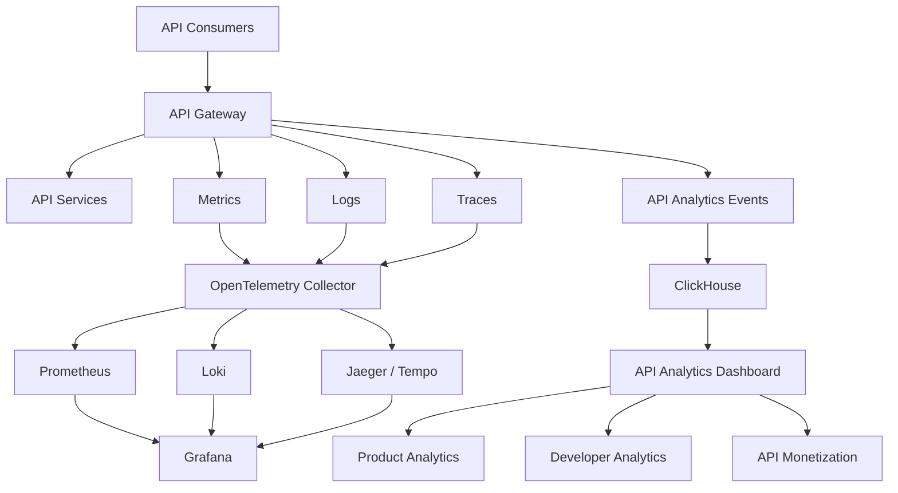
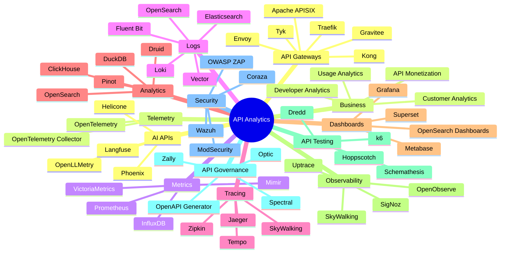

# Awesome-API-Analytics-Platform

## 📊 Top API Analytics & Open-Source API Observability

> A curated list of **API analytics platforms, API observability tools, API monitoring systems, API management analytics and open-source software** for understanding API traffic, performance, reliability, developer usage and business impact.

API analytics sits at the intersection of:

* API observability
* API monitoring
* API gateway analytics
* Usage analytics
* Developer analytics
* API performance monitoring
* API traffic analysis
* Customer/API consumer analytics
* API monetization
* Distributed tracing
* API security analytics
* API lifecycle management

This repository focuses primarily on **open-source and self-hostable alternatives** to commercial platforms such as **Moesif, Treblle, Kong Konnect, Gravitee, Tyk Dashboard, Azure API Management Analytics, Google Apigee Analytics, Akita, SmartBear API Hub and Observe API**.

A modern open-source API analytics stack is usually composed of several layers:

```text
API Gateway
     +
Telemetry
     +
Metrics
     +
Logs
     +
Distributed Tracing
     +
Time-Series Database
     +
Analytics Database
     +
Dashboards
     +
API Metadata
     +
Alerting
     =
Open-Source API Analytics Platform
```

---

## 📑 Table of Contents

* [☁️ SaaS/Hosted Platforms](#️-saashosted-platforms)
* [🌍 Open-Source](#-open-source)
* [🚪 Open-Source API Gateways](#-open-source-api-gateways)
* [📊 Open-Source API Analytics Platforms](#-open-source-api-analytics-platforms)
* [🔭 Open-Source API Observability](#-open-source-api-observability)
* [📈 Open-Source Metrics & Monitoring](#-open-source-metrics--monitoring)
* [📝 Open-Source API Logging](#-open-source-api-logging)
* [🔍 Open-Source Distributed Tracing](#-open-source-distributed-tracing)
* [🗄️ Open-Source Analytics Databases](#️-open-source-analytics-databases)
* [📉 Open-Source Dashboards](#-open-source-dashboards)
* [🔔 Open-Source Alerting](#-open-source-alerting)
* [🧪 Open-Source API Testing & Monitoring](#-open-source-api-testing--monitoring)
* [🧬 Open-Source API Discovery & Contract Analysis](#-open-source-api-discovery--contract-analysis)
* [🔐 Open-Source API Security Analytics](#-open-source-api-security-analytics)
* [🤖 Open-Source AI API Observability](#-open-source-ai-api-observability)
* [🧩 Commercial Platform → Open-Source Equivalent](#-commercial-platform--open-source-equivalent)
* [🏗️ API Analytics Architecture](#️-api-analytics-architecture)
* [🔄 Open-Source API Observability Architecture](#-open-source-api-observability-architecture)
* [📊 API Analytics Data Pipeline](#-api-analytics-data-pipeline)
* [🔭 Three Pillars of API Observability](#-three-pillars-of-api-observability)
* [⚖️ Commercial vs Open-Source](#️-commercial-vs-open-source)
* [🚀 Recommended Open-Source Stacks](#-recommended-open-source-stacks)
* [📈 API Analytics Metrics](#-api-analytics-metrics)
* [🎯 Recommended Projects by Use Case](#-recommended-projects-by-use-case)
* [🏢 Building a Moesif Alternative](#-building-a-moesif-alternative)
* [🏗️ Building an Open-Source API Analytics Platform](#️-building-an-open-source-api-analytics-platform)
* [🌐 Open-Source API Analytics Landscape](#-open-source-api-analytics-landscape)
* [🧠 Why Open-Source API Analytics Matters](#-why-open-source-api-analytics-matters)
* [🤝 Contributing](#-contributing)
* [⚠️ Disclaimer](#️-disclaimer)

---

# ☁️ SaaS/Hosted Platforms

Commercial API analytics platforms provide managed collection, storage, visualization, alerting and API-consumer analytics.

| Platform                                                                               | Company        | Primary Focus                | Key Capabilities                                                          |
| -------------------------------------------------------------------------------------- | -------------- | ---------------------------- | ------------------------------------------------------------------------- |
| [Moesif](https://www.moesif.com/)                                                      | Moesif         | API analytics & monetization | User-centric API analytics, API monitoring, usage analytics, monetization |
| [Treblle](https://treblle.com/)                                                        | Treblle        | API observability            | API monitoring, documentation, analytics and developer experience         |
| [Kong Konnect](https://konghq.com/products/kong-konnect)                               | Kong           | API management & analytics   | API analytics, gateway management, observability and governance           |
| [Gravitee](https://www.gravitee.io/)                                                   | Gravitee       | API management               | API analytics, monitoring, gateway management and observability           |
| [Tyk Dashboard](https://tyk.io/)                                                       | Tyk            | API management               | API analytics, monitoring, gateway analytics and management               |
| [Azure API Management Analytics](https://azure.microsoft.com/products/api-management/) | Microsoft      | Enterprise API management    | API analytics, monitoring, dashboards and diagnostics                     |
| [Google Apigee Analytics](https://cloud.google.com/apigee)                             | Google Cloud   | Enterprise API analytics     | API traffic analytics, developer analytics, API monitoring and management |
| [Akita](https://www.akitasoftware.com/)                                                | Akita Software | API behavior intelligence    | API traffic analysis, API discovery and behavioral analysis               |
| [SmartBear API Hub](https://smartbear.com/product/api-hub/)                            | SmartBear      | API lifecycle                | API catalog, governance, testing, collaboration and analytics             |
| [Observe](https://observeinc.com/)                                                     | Observe        | Data observability           | Logs, metrics, traces and application/API observability                   |
| [Datadog API Monitoring](https://www.datadoghq.com/)                                   | Datadog        | Observability                | API monitoring, distributed tracing, logs and metrics                     |
| [New Relic](https://newrelic.com/)                                                     | New Relic      | Application observability    | API monitoring, APM, logs, traces and metrics                             |
| [Dynatrace](https://www.dynatrace.com/)                                                | Dynatrace      | Enterprise observability     | Distributed tracing, API monitoring and application intelligence          |
| [Elastic Observability](https://www.elastic.co/observability)                          | Elastic        | Search + observability       | Logs, metrics, traces and application analytics                           |
| [Sentry](https://sentry.io/)                                                           | Sentry         | Application monitoring       | Errors, performance, traces and API monitoring                            |
| [Grafana Cloud](https://grafana.com/products/cloud/)                                   | Grafana Labs   | Observability                | Metrics, logs, traces, dashboards and alerting                            |
| [Splunk Observability](https://www.splunk.com/)                                        | Splunk         | Enterprise observability     | Metrics, traces, logs and application monitoring                          |
| [Honeycomb](https://www.honeycomb.io/)                                                 | Honeycomb      | Observability                | High-cardinality event analytics and tracing                              |

Moesif is particularly focused on **user-centric API analytics**, supporting high-cardinality API traffic analysis, customer behavior and API monetization.

---

# 🌍 Open-Source

Unlike commercial API analytics platforms, open-source API analytics is generally **composable**.

The most useful architecture combines an API gateway with OpenTelemetry, metrics, logs, traces and an analytics backend.

```text
                         API TRAFFIC
                              │
                              ▼
                     ┌────────────────┐
                     │  API Gateway   │
                     └───────┬────────┘
                             │
              ┌──────────────┼──────────────┐
              ▼              ▼              ▼
           Metrics          Logs          Traces
              │              │              │
              └──────────────┼──────────────┘
                             ▼
                    OpenTelemetry
                         Collector
                             │
              ┌──────────────┼──────────────┐
              ▼              ▼              ▼
          Prometheus      Loki/ELK         Jaeger
              │              │              │
              └──────────────┼──────────────┘
                             ▼
                          Grafana
```

OpenTelemetry is particularly important because it provides a vendor-neutral telemetry layer for traces, metrics and logs. Tyk, Gravitee and Apache APISIX all provide integrations around OpenTelemetry-based observability.

---

# 🚪 Open-Source API Gateways

API gateways are one of the best places to collect API analytics because they sit directly in the request path.

| Project                                                                 | Description                | Primary Analytics / Observability        |
| ----------------------------------------------------------------------- | -------------------------- | ---------------------------------------- |
| [Apache APISIX](https://github.com/apache/apisix)                       | Cloud-native API gateway   | Prometheus, OpenTelemetry, logs, tracing |
| [Kong Gateway](https://github.com/Kong/kong)                            | API gateway                | Metrics, logs, tracing, plugins          |
| [Tyk Gateway](https://github.com/TykTechnologies/tyk)                   | API gateway                | Analytics, metrics, logs, OpenTelemetry  |
| [Gravitee APIM](https://github.com/gravitee-io/gravitee-api-management) | API management platform    | Analytics, logs, OpenTelemetry           |
| [Envoy Proxy](https://github.com/envoyproxy/envoy)                      | High-performance proxy     | Metrics, logs, tracing                   |
| [Traefik](https://github.com/traefik/traefik)                           | Cloud-native proxy         | Metrics, access logs, tracing            |
| [HAProxy](https://github.com/haproxy/haproxy)                           | Load balancer / proxy      | Metrics, logs and statistics             |
| [NGINX](https://github.com/nginx/nginx)                                 | Web server / reverse proxy | Access logs and metrics                  |
| [Caddy](https://github.com/caddyserver/caddy)                           | Web server / proxy         | Metrics, logs and tracing integrations   |

Apache APISIX explicitly provides observability plugins covering metrics, logs and traces, including OpenTelemetry.

Tyk also supports OpenTelemetry for distributed tracing and telemetry export, making its gateway useful as an open-source API analytics collection point.

---

# 📊 Open-Source API Analytics Platforms

There are fewer true open-source equivalents to Moesif than there are open-source observability components.

Most open-source solutions are therefore assembled from several projects.

| Project                                                                    | Primary Role                | API Analytics |
| -------------------------------------------------------------------------- | --------------------------- | :-----------: |
| [Tyk Gateway](https://github.com/TykTechnologies/tyk)                      | API gateway + analytics     |       ✅       |
| [Gravitee APIM](https://github.com/gravitee-io/gravitee-api-management)    | API management              |       ✅       |
| [Apache APISIX](https://github.com/apache/apisix)                          | API gateway                 |       ✅       |
| [Kong Gateway](https://github.com/Kong/kong)                               | API gateway                 |       ✅       |
| [OpenTelemetry](https://github.com/open-telemetry/opentelemetry-collector) | Telemetry pipeline          |       ✅       |
| [Grafana](https://github.com/grafana/grafana)                              | Analytics dashboards        |       ✅       |
| [SigNoz](https://github.com/SigNoz/signoz)                                 | OpenTelemetry observability |       ✅       |
| [OpenObserve](https://github.com/openobserve/openobserve)                  | Logs / metrics / traces     |       ✅       |
| [Apache SkyWalking](https://github.com/apache/skywalking)                  | APM / tracing               |       ✅       |
| [Uptrace](https://github.com/uptrace/uptrace)                              | OpenTelemetry observability |       ✅       |
| [Jaeger](https://github.com/jaegertracing/jaeger)                          | Distributed tracing         |       ⚠️      |
| [Prometheus](https://github.com/prometheus/prometheus)                     | Metrics                     |       ⚠️      |
| [Loki](https://github.com/grafana/loki)                                    | Logs                        |       ⚠️      |

Tyk's own ecosystem demonstrates a practical open-source API observability architecture using **Tyk Gateway + OpenTelemetry Collector + Jaeger + Prometheus + Grafana**.

---

# 🔭 Open-Source API Observability

## OpenTelemetry

[OpenTelemetry](https://github.com/open-telemetry) is the central standard for modern open-source API observability.

It provides instrumentation and collection for:

```text
                    OpenTelemetry
                         │
          ┌──────────────┼──────────────┐
          ▼              ▼              ▼
        Traces         Metrics          Logs
          │              │              │
          └──────────────┼──────────────┘
                         ▼
                     Collector
                         │
            ┌────────────┼────────────┐
            ▼            ▼            ▼
          Grafana       Jaeger       Loki
```

---

## SigNoz

[SigNoz](https://github.com/SigNoz/signoz) is an open-source observability platform built around OpenTelemetry.

It can provide:

* Metrics
* Traces
* Logs
* Dashboards
* Alerts
* Service maps
* Application performance analysis
* API latency analysis

It is one of the closest open-source alternatives to an integrated commercial observability platform.

---

## OpenObserve

[OpenObserve](https://github.com/openobserve/openobserve) provides an open-source observability platform for:

* Logs
* Metrics
* Traces
* Dashboards
* Alerts
* Search
* Analytics

It is particularly useful when a unified observability backend is preferred over assembling separate log, metric and trace systems.

---

## Apache SkyWalking

[Apache SkyWalking](https://github.com/apache/skywalking) provides:

* APM
* Distributed tracing
* Service topology
* Metrics
* Logs
* Application performance analysis

It can be used to understand API behavior across distributed microservices.

---

## Uptrace

[Uptrace](https://github.com/uptrace/uptrace) is an OpenTelemetry-native observability platform supporting:

* Distributed traces
* Metrics
* Logs
* Dashboards
* Error analysis
* Application performance monitoring

---

# 📈 Open-Source Metrics & Monitoring

| Project                                                                              | Role                                           |
| ------------------------------------------------------------------------------------ | ---------------------------------------------- |
| [Prometheus](https://github.com/prometheus/prometheus)                               | Metrics collection and time-series monitoring  |
| [VictoriaMetrics](https://github.com/VictoriaMetrics/VictoriaMetrics)                | High-performance metrics database              |
| [Grafana Mimir](https://github.com/grafana/mimir)                                    | Scalable Prometheus-compatible metrics storage |
| [Netdata](https://github.com/netdata/netdata)                                        | Real-time infrastructure monitoring            |
| [Zabbix](https://github.com/zabbix/zabbix)                                           | Infrastructure monitoring                      |
| [OpenTelemetry Collector](https://github.com/open-telemetry/opentelemetry-collector) | Telemetry collection                           |
| [Telegraf](https://github.com/influxdata/telegraf)                                   | Metrics collection                             |
| [InfluxDB](https://github.com/influxdata/influxdb)                                   | Time-series database                           |

Important API metrics include:

```text
Requests / second
Error rate
P50 latency
P90 latency
P95 latency
P99 latency
Throughput
Status-code distribution
Endpoint usage
Consumer usage
Regional usage
Authentication failures
Rate-limit events
Payload size
Upstream latency
Gateway latency
```

---

# 📝 Open-Source API Logging

API analytics frequently starts with structured request/response logs.

| Project                                                        | Description                         |
| -------------------------------------------------------------- | ----------------------------------- |
| [Grafana Loki](https://github.com/grafana/loki)                | Log aggregation                     |
| [OpenSearch](https://github.com/opensearch-project/OpenSearch) | Search + log analytics              |
| [Elasticsearch](https://github.com/elastic/elasticsearch)      | Search and analytics                |
| [OpenObserve](https://github.com/openobserve/openobserve)      | Logs + observability                |
| [Fluent Bit](https://github.com/fluent/fluent-bit)             | Lightweight log collector           |
| [Vector](https://github.com/vectordotdev/vector)               | High-performance telemetry pipeline |
| [Fluentd](https://github.com/fluent/fluentd)                   | Log aggregation                     |
| [Logstash](https://github.com/elastic/logstash)                | Data processing pipeline            |

A typical API log event:

```json
{
  "timestamp": "2026-09-10T12:00:00Z",
  "method": "GET",
  "path": "/v1/customers",
  "status_code": 200,
  "latency_ms": 84,
  "user_id": "user_123",
  "api_key": "key_456",
  "region": "us-east-1",
  "request_size": 521,
  "response_size": 8421
}
```

---

# 🔍 Open-Source Distributed Tracing

| Project                                                                    | Description                  |
| -------------------------------------------------------------------------- | ---------------------------- |
| [Jaeger](https://github.com/jaegertracing/jaeger)                          | Distributed tracing          |
| [Zipkin](https://github.com/openzipkin/zipkin)                             | Distributed tracing          |
| [OpenTelemetry](https://github.com/open-telemetry/opentelemetry-collector) | Standard telemetry framework |
| [Grafana Tempo](https://github.com/grafana/tempo)                          | Scalable trace storage       |
| [Apache SkyWalking](https://github.com/apache/skywalking)                  | APM + distributed tracing    |
| [SigNoz](https://github.com/SigNoz/signoz)                                 | OpenTelemetry observability  |
| [Uptrace](https://github.com/uptrace/uptrace)                              | OpenTelemetry observability  |

Distributed tracing is particularly useful for determining whether API latency comes from:

```text
Client
  │
  ▼
API Gateway
  │
  ▼
Authentication
  │
  ▼
API Service
  │
  ▼
Database
  │
  ▼
Third-Party API
```

---

# 🗄️ Open-Source Analytics Databases

High-cardinality API analytics can generate enormous volumes of events.

| Database                                                              | Best Use                        |
| --------------------------------------------------------------------- | ------------------------------- |
| [ClickHouse](https://github.com/ClickHouse/ClickHouse)                | High-volume analytical events   |
| [Apache Druid](https://github.com/apache/druid)                       | Real-time OLAP                  |
| [Apache Pinot](https://github.com/apache/pinot)                       | Low-latency real-time analytics |
| [DuckDB](https://github.com/duckdb/duckdb)                            | Local analytical workloads      |
| [PostgreSQL](https://github.com/postgres/postgres)                    | General-purpose metadata        |
| [OpenSearch](https://github.com/opensearch-project/OpenSearch)        | Search + log analytics          |
| [Elasticsearch](https://github.com/elastic/elasticsearch)             | Search + analytics              |
| [TimescaleDB](https://github.com/timescale/timescaledb)               | Time-series PostgreSQL          |
| [VictoriaMetrics](https://github.com/VictoriaMetrics/VictoriaMetrics) | Metrics storage                 |

For a Moesif-style high-cardinality API analytics system, **ClickHouse** is particularly attractive because API events naturally map to analytical workloads.

---

# 📉 Open-Source Dashboards

| Project                                                                              | Description                      |
| ------------------------------------------------------------------------------------ | -------------------------------- |
| [Grafana](https://github.com/grafana/grafana)                                        | General observability dashboards |
| [Apache Superset](https://github.com/apache/superset)                                | Business intelligence            |
| [Metabase](https://github.com/metabase/metabase)                                     | BI and analytics                 |
| [OpenSearch Dashboards](https://github.com/opensearch-project/OpenSearch-Dashboards) | Search / log analytics           |
| [Kibana](https://github.com/elastic/kibana)                                          | Elasticsearch analytics          |
| [Redash](https://github.com/getredash/redash)                                        | SQL analytics                    |
| [Lightdash](https://github.com/lightdash/lightdash)                                  | Analytics / BI                   |

A useful division is:

```text
Operational Observability
        │
        ▼
      Grafana

Business / Product Analytics
        │
        ▼
 Apache Superset / Metabase
```

---

# 🔔 Open-Source Alerting

| Project                                                               | Role                           |
| --------------------------------------------------------------------- | ------------------------------ |
| [Prometheus Alertmanager](https://github.com/prometheus/alertmanager) | Metrics alerting               |
| [Grafana Alerting](https://github.com/grafana/grafana)                | Unified alerting               |
| [ElastAlert](https://github.com/jertel/elastalert2)                   | Elasticsearch alerting         |
| [Zabbix](https://github.com/zabbix/zabbix)                            | Monitoring and alerting        |
| [Alertmanager](https://github.com/prometheus/alertmanager)            | Alert routing and notification |

Example API alerts:

```text
Error rate > 5%
P99 latency > 2 seconds
5xx spike > 3x baseline
Traffic drops > 50%
Traffic increases > 500%
Authentication failures spike
Rate-limit violations spike
Upstream timeout rate increases
API consumer usage suddenly drops
```

---

# 🧪 Open-Source API Testing & Monitoring

API analytics becomes substantially more useful when combined with API testing.

| Project                                                      | Description                        |
| ------------------------------------------------------------ | ---------------------------------- |
| [k6](https://github.com/grafana/k6)                          | Load and performance testing       |
| [Postman](https://www.postman.com/)                          | API development / testing platform |
| [Hoppscotch](https://github.com/hoppscotch/hoppscotch)       | Open-source API client             |
| [Schemathesis](https://github.com/schemathesis/schemathesis) | OpenAPI-based property testing     |
| [Dredd](https://github.com/apiaryio/dredd)                   | API contract testing               |
| [HTTPie](https://github.com/httpie/cli)                      | HTTP client                        |
| [Vegeta](https://github.com/tsenart/vegeta)                  | HTTP load testing                  |
| [Locust](https://github.com/locustio/locust)                 | Load testing                       |

---

# 🧬 Open-Source API Discovery & Contract Analysis

API analytics should not only tell you **how APIs perform**.

It should also help answer:

> **What APIs actually exist in production?**

| Project                                                                | Description                                |
| ---------------------------------------------------------------------- | ------------------------------------------ |
| [Optic](https://github.com/opticdev/optic)                             | API change detection and contract analysis |
| [OpenAPI Generator](https://github.com/OpenAPITools/openapi-generator) | OpenAPI tooling                            |
| [Swagger Parser](https://github.com/swagger-api/swagger-parser)        | OpenAPI parsing                            |
| [Spectral](https://github.com/stoplightio/spectral)                    | API linting                                |
| [Schemathesis](https://github.com/schemathesis/schemathesis)           | API schema testing                         |
| [Zally](https://github.com/zalando/zally)                              | OpenAPI governance                         |
| [APIDog](https://github.com/Apidog/APIDog)                             | API design/testing tooling                 |

A production API discovery architecture:

```text
Production Traffic
        │
        ▼
API Gateway / Proxy
        │
        ▼
Traffic Capture
        │
        ▼
Schema Inference
        │
        ▼
API Inventory
        │
        ▼
OpenAPI / Contract
        │
        ▼
API Governance
```

---

# 🔐 Open-Source API Security Analytics

API analytics and API security increasingly overlap.

| Project                                                                                   | Primary Role                         |
| ----------------------------------------------------------------------------------------- | ------------------------------------ |
| [Coraza WAF](https://github.com/corazawaf/coraza)                                         | Open-source Web Application Firewall |
| [ModSecurity](https://github.com/owasp-modsecurity/ModSecurity)                           | WAF engine                           |
| [OWASP ZAP](https://github.com/zaproxy/zaproxy)                                           | API/web security testing             |
| [Falco](https://github.com/falcosecurity/falco)                                           | Runtime threat detection             |
| [Wazuh](https://github.com/wazuh/wazuh)                                                   | Security monitoring                  |
| [Suricata](https://github.com/OISF/suricata)                                              | Network threat detection             |
| [OpenSearch Security Analytics](https://github.com/opensearch-project/security-analytics) | Security analytics                   |

Useful API security signals include:

```text
Authentication failures
Authorization failures
Unusual API consumers
Credential abuse
Traffic anomalies
Endpoint enumeration
High-frequency requests
Unexpected payloads
Schema violations
Sensitive-data exposure
Suspicious geographic changes
```

---

# 🤖 Open-Source AI API Observability

Modern AI applications introduce another API analytics dimension.

Instead of only measuring:

```text
HTTP Request
Latency
Status Code
```

AI API analytics also needs:

```text
Model
Provider
Prompt Tokens
Completion Tokens
Total Tokens
Latency
Time To First Token
Cost
Prompt
Response
Tool Calls
Agent Steps
Errors
Retries
Cache Hits
```

Useful open-source projects include:

| Project                                                   | Focus                                              |
| --------------------------------------------------------- | -------------------------------------------------- |
| [OpenLLMetry](https://github.com/traceloop/openllmetry)   | OpenTelemetry instrumentation for LLM applications |
| [Phoenix](https://github.com/Arize-ai/phoenix)            | LLM observability                                  |
| [Langfuse](https://github.com/langfuse/langfuse)          | LLM analytics and tracing                          |
| [Helicone](https://github.com/Helicone/helicone)          | LLM observability                                  |
| [OpenTelemetry](https://github.com/open-telemetry)        | Telemetry standard                                 |
| [SigNoz](https://github.com/SigNoz/signoz)                | OpenTelemetry observability                        |
| [OpenObserve](https://github.com/openobserve/openobserve) | Logs / metrics / traces                            |

This enables a unified API analytics platform for both conventional APIs and AI APIs.

---

# 🧩 Commercial Platform → Open-Source Equivalent

| Commercial Platform                | Open-Source Equivalent / Building Blocks                            |
| ---------------------------------- | ------------------------------------------------------------------- |
| **Moesif**                         | OpenTelemetry + ClickHouse + Grafana + API Gateway                  |
| **Treblle**                        | API Gateway + OpenTelemetry + Grafana + ClickHouse                  |
| **Kong Konnect Analytics**         | Kong Gateway OSS + Prometheus + Grafana + OpenTelemetry             |
| **Gravitee Analytics**             | Gravitee APIM + OpenTelemetry + Grafana                             |
| **Tyk Dashboard**                  | Tyk Gateway + Tyk Pump + Prometheus + Grafana                       |
| **Azure API Management Analytics** | Apache APISIX / Kong / Tyk + OpenTelemetry + Grafana                |
| **Google Apigee Analytics**        | API Gateway + OpenTelemetry + ClickHouse + Grafana                  |
| **Akita**                          | API traffic capture + OpenTelemetry + schema inference + ClickHouse |
| **SmartBear API Hub**              | OpenAPI + Spectral + Optic + Grafana + API catalog                  |
| **Observe API**                    | OpenTelemetry + ClickHouse / OpenSearch + Grafana                   |
| **Datadog API Monitoring**         | OpenTelemetry + Prometheus + Loki + Tempo + Grafana                 |
| **New Relic API Monitoring**       | OpenTelemetry + Prometheus + Grafana + Jaeger                       |
| **Dynatrace API Analytics**        | OpenTelemetry + Grafana + ClickHouse                                |
| **Honeycomb**                      | OpenTelemetry + ClickHouse + Grafana                                |
| **API Analytics SaaS**             | OpenTelemetry + ClickHouse + Grafana + API Gateway                  |

---

# 🏗️ API Analytics Architecture



---

# 🔄 Open-Source API Observability Architecture

```text id="5q0r1d"
                         API CLIENTS
                             │
                             ▼
                    ┌─────────────────┐
                    │   API Gateway   │
                    │ APISIX/Kong/Tyk │
                    └────────┬────────┘
                             │
               ┌─────────────┼─────────────┐
               │             │             │
               ▼             ▼             ▼
            Metrics        Logs          Traces
               │             │             │
               └─────────────┼─────────────┘
                             ▼
                  OpenTelemetry Collector
                             │
          ┌──────────────────┼──────────────────┐
          ▼                  ▼                  ▼
      Prometheus           Loki              Tempo
          │                  │                  │
          └──────────────────┼──────────────────┘
                             ▼
                          Grafana
```

---

# 📊 API Analytics Data Pipeline

A Moesif-style event analytics architecture can be built using an analytical database:

```text
                    API REQUEST
                        │
                        ▼
                  API Gateway
                        │
                        ▼
                 Event Collector
                        │
                        ▼
             OpenTelemetry Collector
                        │
                        ▼
                  Event Stream
                        │
             ┌──────────┴──────────┐
             ▼                     ▼
        Operational             Analytics
        Telemetry               Events
             │                     │
             ▼                     ▼
       Prometheus/Loki        ClickHouse
             │                     │
             └──────────┬──────────┘
                        ▼
                     Grafana
                        │
             ┌──────────┼──────────┐
             ▼          ▼          ▼
          Product    Developer    Business
          Analytics   Analytics   Analytics
```

---

# 🔭 Three Pillars of API Observability

API observability can be reduced to three fundamental signals:

```text
                         API OBSERVABILITY
                                │
             ┌──────────────────┼──────────────────┐
             │                  │                  │
             ▼                  ▼                  ▼
           METRICS             LOGS              TRACES
             │                  │                  │
             ▼                  ▼                  ▼
        How much?           What happened?     Why is it slow?
```

## Metrics

```text
Requests/sec
Error rate
Latency
Throughput
Saturation
Status codes
```

## Logs

```text
Request
Response
Headers
Payload metadata
Authentication
Errors
Consumer
Endpoint
```

## Traces

```text
Gateway
  ↓
Authentication
  ↓
Service
  ↓
Database
  ↓
Third-party API
```

Tyk, Gravitee and Apache APISIX all demonstrate this model through their gateway observability integrations.

---

# 👤 API Consumer Analytics

One of the most important differences between generic infrastructure monitoring and API analytics is **consumer-level analysis**.

A useful event schema should contain:

```text
API
Endpoint
Method
Version
Consumer
Organization
API Key
User
Application
Status Code
Latency
Region
Country
Request Size
Response Size
Timestamp
Error
Trace ID
```

This enables questions such as:

```text
Which customers use our API the most?

Which customers are experiencing the most errors?

Which endpoints are most valuable?

Which customers are approaching their quota?

Which API version is still being used?

Which customers experienced latency spikes?

Which endpoints are generating the most infrastructure cost?
```

This consumer-centric approach is a core part of Moesif's analytics model.

---

# 💵 API Monetization Analytics

API analytics can also become the foundation for usage-based billing.

```text
API Call
   │
   ▼
Usage Event
   │
   ▼
Customer
   │
   ▼
Usage Meter
   │
   ▼
Aggregation
   │
   ▼
Pricing Plan
   │
   ▼
Invoice
```

Example:

```text
Customer A
  │
  ├── 1,200,000 API calls
  ├── 40 GB transferred
  ├── 12,000 premium operations
  └── 300 AI requests
            │
            ▼
       Usage Meter
            │
            ▼
       Billing Engine
```

Possible open-source components:

```text
API Gateway
+
OpenTelemetry
+
ClickHouse
+
Grafana
+
Kill Bill
+
Formance
```

---

# 📈 API Analytics Metrics

## Traffic Metrics

| Metric           | Description             |
| ---------------- | ----------------------- |
| Requests         | Total API calls         |
| RPS              | Requests per second     |
| Throughput       | Requests over time      |
| Unique Consumers | Number of API consumers |
| Unique Endpoints | Active endpoints        |
| Payload Volume   | Bytes transferred       |

## Reliability Metrics

| Metric       | Description                |
| ------------ | -------------------------- |
| 2xx Rate     | Successful requests        |
| 4xx Rate     | Client errors              |
| 5xx Rate     | Server errors              |
| Error Rate   | Overall failure percentage |
| Availability | API uptime                 |

## Performance Metrics

| Metric           | Description             |
| ---------------- | ----------------------- |
| P50              | Median latency          |
| P90              | High-percentile latency |
| P95              | Tail latency            |
| P99              | Extreme tail latency    |
| TTFT             | Time to first token     |
| Upstream Latency | Backend processing time |
| Gateway Latency  | Gateway overhead        |

## Consumer Metrics

```text
Requests per customer
Errors per customer
Latency per customer
Endpoints per customer
Usage by API key
Usage by application
Usage by organization
Usage by geography
```

---

# 🧮 High-Cardinality API Analytics

Traditional infrastructure monitoring might aggregate:

```text
GET /users → 2.3M requests
```

API analytics often needs:

```text
GET /users
  │
  ├── customer_001 → 42,000
  ├── customer_002 → 18,200
  ├── customer_003 → 12,100
  ├── customer_004 → 8,900
  └── ...
```

This creates a **high-cardinality analytics** problem.

A scalable architecture therefore looks like:

```text
API Events
    │
    ▼
Kafka / Redpanda
    │
    ▼
ClickHouse
    │
    ▼
Materialized Views
    │
    ▼
Grafana / Superset
```

---

# ⚖️ Commercial vs Open-Source

| Capability             | SaaS API Analytics   | Open-Source Stack           |
| ---------------------- | -------------------- | --------------------------- |
| API Dashboards         | ✅                    | ✅                           |
| Metrics                | ✅                    | ✅                           |
| Logs                   | ✅                    | ✅                           |
| Tracing                | ✅                    | ✅                           |
| API Consumer Analytics | ✅                    | ✅                           |
| High Cardinality       | ✅                    | ✅                           |
| Custom Dimensions      | ✅                    | ✅                           |
| API Monetization       | Often                | Build / integrate           |
| API Discovery          | Often                | Build / integrate           |
| API Governance         | Often                | Build / integrate           |
| Alerts                 | ✅                    | ✅                           |
| Infrastructure         | Managed              | Self-managed                |
| Scaling                | Managed              | Self-managed                |
| Data Ownership         | Vendor-dependent     | Full control                |
| Data Residency         | Vendor-dependent     | Full control                |
| Air-Gapped             | Limited              | ✅                           |
| Custom Analytics       | Limited              | ✅                           |
| Custom Storage         | Limited              | ✅                           |
| Model / Schema Control | Limited              | High                        |
| Vendor Lock-in         | Higher               | Lower                       |
| Time to Deploy         | Fast                 | Medium                      |
| Operational Complexity | Low                  | High                        |
| Cost at Huge Volume    | Can become expensive | Infrastructure-dependent    |
| Source Code            | Usually proprietary  | Many components open-source |

---

# 🚀 Recommended Open-Source Stacks

## 🏆 1. Best General API Analytics Stack

```text
Apache APISIX
      +
OpenTelemetry
      +
ClickHouse
      +
Grafana
```

Best for:

* API analytics
* High-volume APIs
* Consumer analytics
* Custom dashboards
* Self-hosting

---

## 🔭 2. Full API Observability

```text
Tyk
 +
OpenTelemetry Collector
 +
Prometheus
 +
Loki
 +
Tempo
 +
Grafana
```

Tyk itself provides a documented OpenTelemetry-based observability path, and its ecosystem includes an example combining Tyk, OpenTelemetry, Jaeger, Prometheus and Grafana.

---

## ⚡ 3. High-Cardinality Analytics

```text
API Gateway
     +
Kafka / Redpanda
     +
ClickHouse
     +
Grafana
```

Best for:

* Millions/billions of API events
* Customer analytics
* Usage-based billing
* API monetization
* Long-term analytics

---

## 🌐 4. Enterprise API Management

```text
Gravitee
   +
OpenTelemetry
   +
Prometheus
   +
Grafana
   +
OpenSearch
```

Gravitee supports OpenTelemetry tracing for API requests in self-hosted and hybrid deployments, allowing telemetry to be exported to external observability systems.

---

## 🔥 5. Lightweight API Observability

```text
Apache APISIX
      +
Prometheus
      +
Grafana
```

APISIX provides observability plugins for metrics, logs and OpenTelemetry tracing.

---

## 🧠 6. AI API Analytics

```text
API Gateway
     +
OpenTelemetry
     +
OpenLLMetry
     +
ClickHouse
     +
Grafana
     +
Langfuse / Phoenix
```

Track:

```text
Model
Provider
Tokens
Latency
Cost
Prompt
Response
Tool Calls
Errors
Retries
```

---

# 📊 API Analytics Technology Comparison

| Platform / Stack     | API Analytics | Metrics | Logs | Traces | Consumer Analytics | Self-Host |
| -------------------- | :-----------: | :-----: | :--: | :----: | :----------------: | :-------: |
| Moesif               |       ✅       |    ✅    |   ✅  |   ⚠️   |          ✅         |     ❌     |
| Treblle              |       ✅       |    ✅    |   ✅  |   ⚠️   |          ✅         |     ⚠️    |
| Kong Konnect         |       ✅       |    ✅    |   ✅  |    ✅   |          ✅         |     ⚠️    |
| Gravitee             |       ✅       |    ✅    |   ✅  |    ✅   |          ✅         |     ✅     |
| Tyk                  |       ✅       |    ✅    |   ✅  |    ✅   |          ✅         |     ✅     |
| Apigee               |       ✅       |    ✅    |   ✅  |    ✅   |          ✅         |     ❌     |
| Akita                |       ✅       |    ⚠️   |   ✅  |   ⚠️   |          ✅         |     ❌     |
| SmartBear API Hub    |       ✅       |    ⚠️   |  ⚠️  |   ⚠️   |          ✅         |     ⚠️    |
| Observe              |       ✅       |    ✅    |   ✅  |    ✅   |         ⚠️         |     ❌     |
| Apache APISIX        |       ✅       |    ✅    |   ✅  |    ✅   |        Build       |     ✅     |
| OpenTelemetry        |       ⚠️      |    ✅    |   ✅  |    ✅   |        Build       |     ✅     |
| SigNoz               |       ✅       |    ✅    |   ✅  |    ✅   |        Build       |     ✅     |
| OpenObserve          |       ✅       |    ✅    |   ✅  |    ✅   |        Build       |     ✅     |
| Grafana Stack        |     Build     |    ✅    |   ✅  |    ✅   |        Build       |     ✅     |
| ClickHouse + Grafana |       ✅       |    ⚠️   |   ✅  |   ⚠️   |          ✅         |     ✅     |

---

# 🎯 Recommended Projects by Use Case

| Use Case                                       | Recommended Starting Point                        |
| ---------------------------------------------- | ------------------------------------------------- |
| Closest open-source API analytics architecture | **APISIX + OpenTelemetry + ClickHouse + Grafana** |
| API gateway analytics                          | **Tyk / APISIX / Kong / Gravitee**                |
| Best telemetry standard                        | **OpenTelemetry**                                 |
| High-cardinality API analytics                 | **ClickHouse**                                    |
| General dashboards                             | **Grafana**                                       |
| Full open-source observability                 | **SigNoz**                                        |
| Logs + metrics + traces in one platform        | **OpenObserve**                                   |
| Distributed tracing                            | **Jaeger / Tempo**                                |
| Metrics                                        | **Prometheus**                                    |
| Long-term metrics                              | **VictoriaMetrics / Mimir**                       |
| Logs                                           | **Loki / OpenSearch**                             |
| API testing                                    | **k6 / Schemathesis**                             |
| API contract analysis                          | **Optic / Spectral**                              |
| API governance                                 | **Spectral / Zally**                              |
| API security analytics                         | **OpenSearch / Wazuh / Coraza**                   |
| AI API analytics                               | **OpenLLMetry + Langfuse / Phoenix**              |
| API monetization                               | **ClickHouse + Grafana + Kill Bill**              |
| Enterprise API management                      | **Gravitee / Tyk / APISIX**                       |
| Moesif-style consumer analytics                | **ClickHouse + OpenTelemetry + Grafana**          |

---

# 🏢 Building a Moesif Alternative

A self-hosted Moesif-style system can be constructed from:

```text
                         API TRAFFIC
                              │
                              ▼
                       Apache APISIX
                              │
                              ▼
                   OpenTelemetry Collector
                              │
                              ▼
                         Kafka / NATS
                              │
                              ▼
                         ClickHouse
                              │
              ┌───────────────┼───────────────┐
              ▼               ▼               ▼
          API Usage       Customers        Errors
          Analytics        Analytics       Analytics
              │               │               │
              └───────────────┼───────────────┘
                              ▼
                           Grafana
                              │
              ┌───────────────┼───────────────┐
              ▼               ▼               ▼
          Dashboards        Alerts        Reports
```

Moesif itself emphasizes high-cardinality, high-dimensional API event analytics and customer behavior, so **ClickHouse + OpenTelemetry + Grafana** is a particularly natural open-source architectural approximation.

---

# 🏗️ Building an Open-Source API Analytics Platform

A complete platform can be decomposed into:

```text
┌─────────────────────────────────────────────────────┐
│                  API CONSUMERS                      │
└──────────────────────────┬──────────────────────────┘
                           │
                           ▼
┌─────────────────────────────────────────────────────┐
│                    API GATEWAY                      │
│             APISIX / Kong / Tyk / Gravitee         │
└──────────────────────────┬──────────────────────────┘
                           │
                           ▼
┌─────────────────────────────────────────────────────┐
│                  TELEMETRY LAYER                    │
│                 OpenTelemetry                       │
└──────────────────────────┬──────────────────────────┘
                           │
            ┌──────────────┼──────────────┐
            ▼              ▼              ▼
         Metrics          Logs          Traces
            │              │              │
            ▼              ▼              ▼
      Prometheus         Loki          Tempo
            │              │              │
            └──────────────┼──────────────┘
                           │
                           ▼
┌─────────────────────────────────────────────────────┐
│               ANALYTICS DATA LAYER                  │
│        ClickHouse / OpenSearch / Pinot / Druid      │
└──────────────────────────┬──────────────────────────┘
                           │
                           ▼
┌─────────────────────────────────────────────────────┐
│                 ANALYTICS LAYER                     │
│              Grafana / Superset / Metabase          │
└──────────────────────────┬──────────────────────────┘
                           │
             ┌─────────────┼─────────────┐
             ▼             ▼             ▼
          Product       Developer      Business
          Analytics      Analytics     Analytics
```

---

# 🧱 API Analytics Layers

```text
┌─────────────────────────────────────────────┐
│             PRODUCT ANALYTICS              │
│ Customers • Usage • Growth • Monetization   │
└───────────────────────┬─────────────────────┘
                        │
┌───────────────────────▼─────────────────────┐
│              API ANALYTICS                  │
│ Endpoints • Consumers • Versions • Errors   │
└───────────────────────┬─────────────────────┘
                        │
┌───────────────────────▼─────────────────────┐
│              OBSERVABILITY                  │
│ Metrics • Logs • Traces • Profiles          │
└───────────────────────┬─────────────────────┘
                        │
┌───────────────────────▼─────────────────────┐
│               TELEMETRY                    │
│             OpenTelemetry                  │
└───────────────────────┬─────────────────────┘
                        │
┌───────────────────────▼─────────────────────┐
│                GATEWAY                     │
│ APISIX • Kong • Tyk • Gravitee • Envoy     │
└─────────────────────────────────────────────┘
```

---

# 🌐 Open-Source API Analytics Landscape



---

# 🧠 Why Open-Source API Analytics Matters

Commercial API analytics platforms are extremely useful because they package together:

```text
Collection
+
Storage
+
Querying
+
Dashboards
+
Alerts
+
Consumer Analytics
+
API Governance
+
Monetization
```

Open-source allows these layers to be separated:

```text
             API Gateway
                  │
                  ▼
            OpenTelemetry
                  │
        ┌─────────┼─────────┐
        ▼         ▼         ▼
     Metrics     Logs     Traces
        │         │         │
        ▼         ▼         ▼
   Prometheus    Loki     Tempo
        │         │         │
        └─────────┼─────────┘
                  ▼
               Grafana
```

The result is:

* Full data ownership
* Self-hosting
* Air-gapped deployment
* Custom retention policies
* Custom analytics schemas
* Custom dashboards
* Custom alerting
* No mandatory vendor lock-in
* Ability to select the database independently
* Ability to process high-cardinality API events
* Ability to integrate API analytics with internal data platforms

The trade-off is that **you become responsible for operating the platform**.

---

# 🔥 Recommended Open-Source Reference Architecture

For a serious production API analytics platform:

```text
                         CLIENTS
                            │
                            ▼
                    ┌───────────────┐
                    │ API Gateway   │
                    │ APISIX / Tyk  │
                    └───────┬───────┘
                            │
                            ▼
                   OpenTelemetry
                      Collector
                            │
                   ┌────────┴────────┐
                   ▼                 ▼
              Kafka/Redpanda    Direct OTLP
                   │                 │
                   ▼                 ▼
              ClickHouse      Prometheus/Loki
                   │                 │
                   └────────┬────────┘
                            ▼
                         Grafana
                            │
            ┌───────────────┼───────────────┐
            ▼               ▼               ▼
        API Usage       Consumer        Reliability
        Analytics       Analytics        Analytics
            │               │               │
            └───────────────┼───────────────┘
                            ▼
                       Monetization
```

---

# 🛠️ Suggested Technology Choices

| Layer                | Recommended OSS                           |
| -------------------- | ----------------------------------------- |
| API Gateway          | **Apache APISIX / Tyk / Kong / Gravitee** |
| Telemetry            | **OpenTelemetry**                         |
| Telemetry Collector  | **OpenTelemetry Collector**               |
| Metrics              | **Prometheus**                            |
| Long-term Metrics    | **VictoriaMetrics / Grafana Mimir**       |
| Logs                 | **Loki / OpenSearch**                     |
| Traces               | **Tempo / Jaeger**                        |
| Analytics DB         | **ClickHouse**                            |
| Streaming            | **Kafka / Redpanda / NATS**               |
| Dashboards           | **Grafana**                               |
| BI                   | **Superset / Metabase**                   |
| API Testing          | **k6 / Schemathesis**                     |
| API Governance       | **Spectral / Optic**                      |
| API Security         | **Coraza / Wazuh / OWASP ZAP**            |
| AI API Observability | **OpenLLMetry / Langfuse / Phoenix**      |
| Orchestration        | **Kubernetes**                            |
| Object Storage       | **MinIO**                                 |

---

# 🏆 Closest Open-Source Alternatives

If the objective is specifically to reproduce the major capabilities of the commercial products in this repository:

```text
Moesif
   ↓
OpenTelemetry + ClickHouse + Grafana

Treblle
   ↓
API Gateway + OpenTelemetry + Grafana

Kong Konnect Analytics
   ↓
Kong Gateway OSS + OpenTelemetry + Prometheus + Grafana

Gravitee Analytics
   ↓
Gravitee APIM + OpenTelemetry + Grafana

Tyk Dashboard
   ↓
Tyk Gateway + Tyk Pump + Prometheus + Grafana

Azure API Management Analytics
   ↓
APISIX / Kong / Tyk + OpenTelemetry + Grafana

Google Apigee Analytics
   ↓
API Gateway + OpenTelemetry + ClickHouse + Grafana

Akita
   ↓
Traffic Capture + OpenTelemetry + Schema Inference + ClickHouse

SmartBear API Hub
   ↓
OpenAPI + Spectral + Optic + API Catalog

Observe API
   ↓
OpenTelemetry + ClickHouse / OpenSearch + Grafana
```

---

# 🤝 Contributing

Contributions are welcome!

Please consider adding:

* API analytics platforms
* API observability platforms
* API gateways
* OpenTelemetry integrations
* Metrics systems
* Logging systems
* Distributed tracing projects
* Analytics databases
* API testing tools
* API contract tools
* API discovery tools
* API governance tools
* API security tools
* API monetization systems
* AI API observability tools
* API consumer analytics
* Developer analytics
* API traffic analysis
* Open-source dashboards
* Self-hosted API monitoring systems

When adding a project, please distinguish between:

* **Fully open-source**
* **Open-core**
* **Source available**
* **Hosted commercial service**
* **Open-source component**
* **Commercial platform using open-source components**

Do not classify a proprietary analytics platform as open source simply because it supports OpenTelemetry or uses open-source infrastructure.

---

# ⚠️ Disclaimer

This repository is an independent technical curation and is **not affiliated with or endorsed by any company or project listed here**.

API analytics requirements vary considerably between organizations.

A simple API may only require:

```text
Prometheus
+
Grafana
```

while a large API platform may require:

```text
Gateway
+
OpenTelemetry
+
Kafka
+
ClickHouse
+
Prometheus
+
Loki
+
Tempo
+
Grafana
+
API Catalog
+
API Governance
+
Security Analytics
```

Performance and operational requirements depend on:

* API traffic volume
* Number of APIs
* Number of consumers
* Event cardinality
* Retention period
* Payload size
* Query workload
* Geographic distribution
* Sampling strategy
* Compliance requirements
* Data residency
* Required latency

Always evaluate the current licensing, features and deployment requirements of each project before production use.

---

## ⭐ Star This Repository

If you are interested in:

* API Analytics
* API Observability
* API Monitoring
* API Management
* API Gateways
* OpenTelemetry
* Distributed Tracing
* API Governance
* API Security
* API Monetization
* Developer Analytics
* Open-Source Observability

consider giving this repository a ⭐ **Star** and contributing new projects.

---

**Last updated: September 2026**

