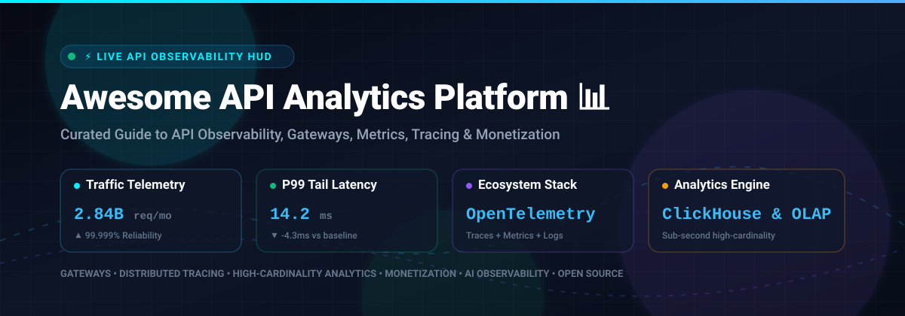
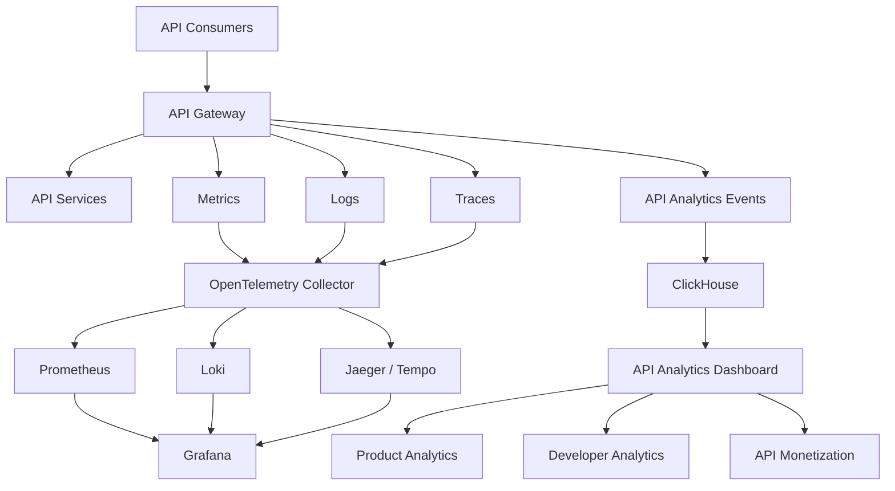
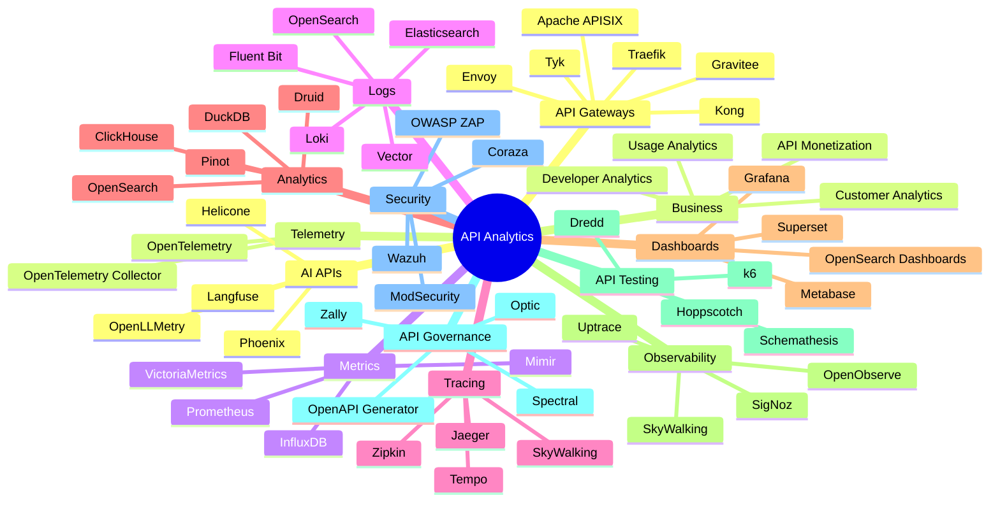

# Awesome-API-Analytics-Platform

<p align="center">
  
</p>

<p align="center">
  <a href="https://github.com/ishandutta2007/Awesome-Awesome-Awesome"></a>
  <a href="https://discord.gg/b4BdfcxW"></a>
  <a href="https://github.com/ishandutta2007/Awesome-API-Analytics-Platform/stargazers"></a>
  <a href="https://github.com/ishandutta2007/Awesome-API-Analytics-Platform/network/members"></a>
  <a href="https://github.com/ishandutta2007/Awesome-API-Analytics-Platform/watchers"></a>
  <a href="https://github.com/ishandutta2007/Awesome-API-Analytics-Platform/graphs/contributors"></a>
  <a href="http://makeapullrequest.com"></a>
  <a href="https://opensource.org/licenses/MIT"></a>
  <a href="https://github.com/ishandutta2007"></a>
</p>

## 📊 Top API Analytics & Open-Source API Observability

> A curated list of **API analytics platforms, API observability tools, API monitoring systems, API management analytics and open-source software** for understanding API traffic, performance, reliability, developer usage and business impact.

API analytics sits at the intersection of:

* API observability
* API monitoring
* API gateway analytics
* Usage analytics
* Developer analytics
* API performance monitoring
* API traffic analysis
* Customer/API consumer analytics
* API monetization
* Distributed tracing
* API security analytics
* API lifecycle management

This repository focuses primarily on **open-source and self-hostable alternatives** to commercial platforms such as **Moesif, Treblle, Kong Konnect, Gravitee, Tyk Dashboard, Azure API Management Analytics, Google Apigee Analytics, Akita, SmartBear API Hub and Observe API**.

A modern open-source API analytics stack is usually composed of several layers:

```text
API Gateway
     +
Telemetry
     +
Metrics
     +
Logs
     +
Distributed Tracing
     +
Time-Series Database
     +
Analytics Database
     +
Dashboards
     +
API Metadata
     +
Alerting
     =
Open-Source API Analytics Platform
```

---

## 📑 Table of Contents

* [☁️ SaaS/Hosted Platforms](#️-saashosted-platforms)
* [🌍 Open-Source](#-open-source)
* [🚪 Open-Source API Gateways](#-open-source-api-gateways)
* [📊 Open-Source API Analytics Platforms](#-open-source-api-analytics-platforms)
* [🔭 Open-Source API Observability](#-open-source-api-observability)
* [📈 Open-Source Metrics & Monitoring](#-open-source-metrics--monitoring)
* [📝 Open-Source API Logging](#-open-source-api-logging)
* [🔍 Open-Source Distributed Tracing](#-open-source-distributed-tracing)
* [🗄️ Open-Source Analytics Databases](#️-open-source-analytics-databases)
* [📉 Open-Source Dashboards](#-open-source-dashboards)
* [🔔 Open-Source Alerting](#-open-source-alerting)
* [🧪 Open-Source API Testing & Monitoring](#-open-source-api-testing--monitoring)
* [🧬 Open-Source API Discovery & Contract Analysis](#-open-source-api-discovery--contract-analysis)
* [🔐 Open-Source API Security Analytics](#-open-source-api-security-analytics)
* [🤖 Open-Source AI API Observability](#-open-source-ai-api-observability)
* [🧩 Commercial Platform → Open-Source Equivalent](#-commercial-platform--open-source-equivalent)
* [🏗️ API Analytics Architecture](#️-api-analytics-architecture)
* [🔄 Open-Source API Observability Architecture](#-open-source-api-observability-architecture)
* [📊 API Analytics Data Pipeline](#-api-analytics-data-pipeline)
* [🔭 Three Pillars of API Observability](#-three-pillars-of-api-observability)
* [⚖️ Commercial vs Open-Source](#️-commercial-vs-open-source)
* [🚀 Recommended Open-Source Stacks](#-recommended-open-source-stacks)
* [📈 API Analytics Metrics](#-api-analytics-metrics)
* [🎯 Recommended Projects by Use Case](#-recommended-projects-by-use-case)
* [🏢 Building a Moesif Alternative](#-building-a-moesif-alternative)
* [🏗️ Building an Open-Source API Analytics Platform](#️-building-an-open-source-api-analytics-platform)
* [🌐 Open-Source API Analytics Landscape](#-open-source-api-analytics-landscape)
* [🧠 Why Open-Source API Analytics Matters](#-why-open-source-api-analytics-matters)
* [🤝 Contributing](#-contributing)
* [⚠️ Disclaimer](#️-disclaimer)

---

# ☁️ SaaS/Hosted Platforms

Commercial API analytics platforms provide managed collection, storage, visualization, alerting and API-consumer analytics.

> 🌐 **Market Overview & Sector Dynamics:** The global API Management, Observability, and Analytics market is estimated at **~$6.2 Billion in 2025/2026** and is projected to reach **$18.5+ Billion by 2030** (CAGR ~24.5%). The sector is **moderately fragmented**—characterized by active competition between hyperscale cloud infrastructure providers (Microsoft Azure, Google Cloud), established enterprise observability leaders (Datadog, Splunk/Cisco, Dynatrace), and nimble, specialized high-cardinality API analytics innovators (Kong, Moesif, Treblle), rather than a single winner-take-all monopoly.

| Platform | Company | Market Cap / Valuation / Scale | Primary Focus | Key Capabilities | Starting Pricing | Free Tier / Free Trial Limits |
| --- | --- | --- | --- | --- | --- | --- |
| [Azure API Management Analytics](https://azure.microsoft.com/products/api-management/) | Microsoft | ~$3.1 Trillion (Market Cap) / ~$245B+ ARR | Enterprise API management | API analytics, monitoring, dashboards and diagnostics | Starts at $3.50 per 1M calls (Consumption tier overage; Developer tier is ~$48/mo, Basic tier ~$147/mo) | Free forever tier with 1,000,000 calls/mo (Consumption tier); 30-day Azure trial with $200 free credit |
| [Google Apigee Analytics](https://cloud.google.com/apigee) | Google Cloud (Alphabet) | ~$2.1 Trillion (Market Cap) / ~$307B+ ARR | Enterprise API analytics | API traffic analytics, developer analytics, API monitoring and management | Starts at ~$365/mo per Base environment + $20 per 1M standard API calls (Pay-as-you-go) | 60-day free evaluation organization for POC testing; new GCP accounts get 90-day trial with $300 credit |
| [Datadog API Monitoring](https://www.datadoghq.com/) | Datadog | ~$40 Billion (Market Cap) / ~$2.5B+ ARR | Observability | API monitoring, distributed tracing, logs and metrics | Starts at $5 per 10,000 synthetic API test runs/mo ($7.20/10k on-demand; APM starts at $31/host/mo) | 14-day free trial with full access to Synthetic Monitoring, APM, and analytics (no credit card required); Infrastructure free tier includes up to 5 hosts (1-day retention) |
| [Splunk Observability](https://www.splunk.com/) | Splunk (Cisco) | $28 Billion (Acquired by Cisco) / ~$3.8B+ ARR | Enterprise observability | Metrics, traces, logs and application monitoring | Starts at $15/host/mo for Infrastructure Monitoring ($60/host/mo for App & Infrastructure Monitoring with APM, billed annually) | Free Edition with up to 15 hosts free forever (full metrics and traces access, no credit card required); 14-day full-featured trial and interactive playground available |
| [Dynatrace](https://www.dynatrace.com/) | Dynatrace | ~$15 Billion (Market Cap) / ~$1.5B+ ARR | Enterprise observability | Distributed tracing, API monitoring and application intelligence | Starts at ~$0.08/hour (~$58/mo per 8 GiB host for Full-Stack Monitoring; Foundation & Discovery starts at ~$7/host/mo; $0.001/synthetic action via DPS) | 15-day free trial with full platform access and OneAgent capabilities (no credit card required; no permanent free tier) |
| [Elastic Observability](https://www.elastic.co/observability) | Elastic | ~$9.2 Billion (Market Cap) / ~$1.3B+ ARR | Search + observability | Logs, metrics, traces and application analytics | Starts at ~$95/mo (Standard hosted cluster; Serverless model starts at $0.07/GB ingested + $0.017/GB retained/mo) | 14-day free trial on Elastic Cloud with full access (no credit card required; includes hosted cluster with 8GB RAM and 240GB storage); Basic license is free self-hosted OSS |
| [New Relic](https://newrelic.com/) | New Relic | $6.5 Billion (Acquisition) / ~$925M+ ARR | Application observability | API monitoring, APM, logs, traces and metrics | Starts at $0.40/GB ingested beyond free allowance ($10/mo Core user, $49/mo Full Platform user on Standard plan) | Free forever tier with 100 GB/mo data ingest, 1 free full-platform user, unlimited basic users, and 8 to 30 days retention |
| [Grafana Cloud](https://grafana.com/products/cloud/) | Grafana Labs | $6.0 Billion (Series D Valuation) / ~$100M+ ARR | Observability | Metrics, logs, traces, dashboards and alerting | Starts at $19/mo platform fee for Pro plan (+ $0.50/1k metrics, $0.50/GB logs/traces beyond free allowance) | Free forever tier with 10,000 active metric series, 50 GB logs, 50 GB traces, 14-day retention, and up to 3 users (no credit card required; 14-day Pro trial upon signup) |
| [Akita](https://www.akitasoftware.com/) | Akita Software (Postman) | $5.6 Billion (Postman Valuation) / ~$100M+ ARR | API behavior intelligence | API traffic analysis, API discovery and behavioral analysis | Starts at $14/user/mo billed annually ($19/user/mo monthly via Postman Team plan; legacy standalone started at $10/service/mo) | Free forever tier with up to 3 users, 1,000 cloud monitoring runs/mo, and Postman Insights Agent; 14-day free trial of paid plans |
| [Sentry](https://sentry.io/) | Sentry | $3.0 Billion (Series E Valuation) / ~$100M+ ARR | Application monitoring | Errors, performance, traces and API monitoring | Starts at $26/mo billed annually ($29/mo monthly for Team plan; includes 50,000 errors and 5M spans/mo) | Free forever Developer plan with 1 user, 5,000 errors/mo, 10,000 performance spans/mo, and 50 session replays/mo; 14-day free trial of Team/Business plans |
| [SmartBear API Hub](https://smartbear.com/product/api-hub/) | SmartBear | ~$2.5 Billion (PE Valuation) / ~$250M+ ARR | API lifecycle | API catalog, governance, testing, collaboration and analytics | Starts at $75/user/mo billed annually ($90/user/mo monthly for SwaggerHub Team plan) | Free forever tier with 1 user, 3 private APIs, and unlimited public APIs; 14-day full-featured free trial |
| [Kong Konnect](https://konghq.com/products/kong-konnect) | Kong | $2.0 Billion (Series E Valuation) / ~$100M+ ARR | API management & analytics | API analytics, gateway management, observability and governance | Starts at $25/mo per Serverless Control Plane ($200/mo for Hybrid; includes 1M API requests and 1M analytics events/mo) | 30-day free trial with full Enterprise access, unlimited gateways/API requests, and 30-day analytics retention (no credit card required) |
| [Moesif](https://www.moesif.com/) | Moesif (WSO2) | ~$700 Million (WSO2 Parent Valuation) / ~$15M ARR | API analytics & monetization | User-centric API analytics, API monitoring, usage analytics, monetization | Starts at $60/mo (Growth plan; $75/mo per extra team member) | Free forever tier with 30,000 events/mo; 14-day free trial of Growth plan with up to 10,000,000 events (no credit card required) |
| [Observe](https://observeinc.com/) | Observe | ~$550 Million (Series B Valuation) / $145M+ Funding | Data observability | Logs, metrics, traces and application/API observability | Starts at $0.49/GiB for Logs, $0.008/DPM for Metrics, and $0.59/GiB for Traces ($0.01/GiB/mo for extended retention; unlimited users) | 14-day free trial with full platform access and trial usage credits (no credit card required, instant provisioning) |
| [Honeycomb](https://www.honeycomb.io/) | Honeycomb | ~$500 Million (Series D Valuation) / $150M Funding | Observability | High-cardinality event analytics and tracing | Starts at $150/mo (Pro plan; includes up to 750M events/mo, Time Series Metrics, and Honeycomb Intelligence) | Free forever tier with 20 million events/mo, 100 million time series metrics/mo, 60-day retention, and unlimited seats (no credit card required) |
| [Gravitee](https://www.gravitee.io/) | Gravitee | ~$350 Million (Series C Valuation) / $90M+ Funding | API management | API analytics, monitoring, gateway management and observability | Starts at ~$2,500/mo (Managed Cloud; Enterprise APIM starting ~$1,500/mo billed annually) | 14-day free trial of Enterprise Edition via Cockpit (no credit card required; full enterprise features); Community Edition is 100% free self-hosted OSS |
| [Tyk Dashboard](https://tyk.io/) | Tyk | ~$150 Million (Series B Valuation) / $35M+ Funding | API management | API analytics, monitoring, gateway analytics and management | Starts at ~$600/mo (Tyk Cloud Core plan) | 48-hour immediate trial or 5-week (35-day) Proof-of-Concept trial with full platform access (no credit card required); Tyk Gateway OSS is free self-hosted |
| [Treblle](https://treblle.com/) | Treblle | ~$35 Million (Series A Valuation) / $9M+ Funding | API observability | API monitoring, documentation, analytics and developer experience | Starts at $233/mo (Core plan) | Free forever tier with 250,000 API requests/mo and 3-day data retention (no credit card required) |

Moesif is particularly focused on **user-centric API analytics**, supporting high-cardinality API traffic analysis, customer behavior and API monetization.

---

# 🌍 Open-Source

Unlike commercial API analytics platforms, open-source API analytics is generally **composable**.

The most useful architecture combines an API gateway with OpenTelemetry, metrics, logs, traces and an analytics backend.

```text
                         API TRAFFIC
                              │
                              ▼
                     ┌────────────────┐
                     │  API Gateway   │
                     └───────┬────────┘
                             │
              ┌──────────────┼──────────────┐
              ▼              ▼              ▼
           Metrics          Logs          Traces
              │              │              │
              └──────────────┼──────────────┘
                             ▼
                    OpenTelemetry
                         Collector
                             │
              ┌──────────────┼──────────────┐
              ▼              ▼              ▼
          Prometheus      Loki/ELK         Jaeger
              │              │              │
              └──────────────┼──────────────┘
                             ▼
                          Grafana
```

OpenTelemetry is particularly important because it provides a vendor-neutral telemetry layer for traces, metrics and logs. Tyk, Gravitee and Apache APISIX all provide integrations around OpenTelemetry-based observability.

---

# 🚪 Open-Source API Gateways

API gateways are one of the best places to collect API analytics because they sit directly in the request path.

| Project | Description | Primary Analytics / Observability |
| --- | --- | --- |
| [Caddy](https://github.com/caddyserver/caddy) [](https://github.com/caddyserver/caddy/stargazers) | Cloud-native web server / reverse proxy with automatic HTTPS | Metrics, access logs, OpenTelemetry and tracing integrations |
| [Traefik](https://github.com/traefik/traefik) [](https://github.com/traefik/traefik/stargazers) | Cloud-native modern HTTP reverse proxy and load balancer | Metrics (Prometheus, Datadog), access logs, OpenTelemetry tracing |
| [Kong Gateway](https://github.com/Kong/kong) [](https://github.com/Kong/kong/stargazers) | Cloud-native API gateway & microservices abstraction layer | Plugin ecosystem, Prometheus metrics, Zipkin/Jaeger, OpenTelemetry |
| [NGINX](https://github.com/nginx/nginx) [](https://github.com/nginx/nginx/stargazers) | High-performance web server, reverse proxy and load balancer | Access logs, stub_status, real-time statistics, OpenTelemetry module |
| [Envoy Proxy](https://github.com/envoyproxy/envoy) [](https://github.com/envoyproxy/envoy/stargazers) | Cloud-native high-performance edge/middle/service proxy | Extensive stats/metrics, access logging, distributed tracing (W3C/OTel) |
| [Apache APISIX](https://github.com/apache/apisix) [](https://github.com/apache/apisix/stargazers) | Dynamic, real-time, high-performance API gateway | Native OpenTelemetry plugin, Prometheus metrics, SkyWalking, ClickHouse logger |
| [Tyk Gateway](https://github.com/TykTechnologies/tyk) [](https://github.com/TykTechnologies/tyk/stargazers) | Open-source enterprise API gateway written in Go | Built-in analytics engine, OpenTelemetry, Prometheus, Tyk Pump |
| [HAProxy](https://github.com/haproxy/haproxy) [](https://github.com/haproxy/haproxy/stargazers) | Reliable, high-performance TCP/HTTP load balancer | Built-in Prometheus exporter, detailed HTTP access logging, metrics socket |
| [KrakenD](https://github.com/krakend/krakend-ce) [](https://github.com/krakend/krakend-ce/stargazers) | Ultra-performant stateless open-source API gateway | Prometheus metrics, OpenTelemetry, InfluxDB, Jaeger distributed tracing |
| [WSO2 API Manager](https://github.com/wso2/product-apim) [](https://github.com/wso2/product-apim/stargazers) | Complete open-source enterprise API lifecycle management platform | Choreo-based / ELK analytics, OpenTelemetry tracing, usage dashboards |
| [Gravitee APIM](https://github.com/gravitee-io/gravitee-api-management) [](https://github.com/gravitee-io/gravitee-api-management/stargazers) | Flexible and comprehensive open-source API management platform | Native analytics, Elasticsearch/OpenSearch reporting, OpenTelemetry |
| [Gloo Gateway](https://github.com/solo-io/gloo) [](https://github.com/solo-io/gloo/stargazers) | Next-generation cloud-native Envoy-powered API gateway | Prometheus metrics, Grafana dashboards, OpenTelemetry distributed tracing |

Apache APISIX explicitly provides observability plugins covering metrics, logs and traces, including OpenTelemetry.

Tyk also supports OpenTelemetry for distributed tracing and telemetry export, making its gateway useful as an open-source API analytics collection point.

---

# 📊 Open-Source API Analytics Platforms

There are fewer true open-source equivalents to Moesif than there are open-source observability components.

Most open-source solutions are therefore assembled from several projects.

| Project | Primary Role | API Analytics |
| --- | --- | :---: |
| [Grafana](https://github.com/grafana/grafana) [](https://github.com/grafana/grafana/stargazers) | Analytics visualization & dashboard platform | ✅ |
| [Prometheus](https://github.com/prometheus/prometheus) [](https://github.com/prometheus/prometheus/stargazers) | Time-series metrics collection & alerting | ✅ |
| [Kong Gateway](https://github.com/Kong/kong) [](https://github.com/Kong/kong/stargazers) | API gateway with analytics plugins | ✅ |
| [SigNoz](https://github.com/SigNoz/signoz) [](https://github.com/SigNoz/signoz/stargazers) | OpenTelemetry-native APM & observability platform | ✅ |
| [Grafana Loki](https://github.com/grafana/loki) [](https://github.com/grafana/loki/stargazers) | High-efficiency horizontally scalable log aggregation | ⚠️ |
| [Apache SkyWalking](https://github.com/apache/skywalking) [](https://github.com/apache/skywalking/stargazers) | Distributed tracing & APM for cloud-native APIs | ✅ |
| [Jaeger](https://github.com/jaegertracing/jaeger) [](https://github.com/jaegertracing/jaeger/stargazers) | End-to-end distributed tracing system | ⚠️ |
| [OpenObserve](https://github.com/openobserve/openobserve) [](https://github.com/openobserve/openobserve/stargazers) | Unified cloud-native logs, metrics, and traces engine | ✅ |
| [Apache APISIX](https://github.com/apache/apisix) [](https://github.com/apache/apisix/stargazers) | API gateway with native OpenTelemetry & analytics plugins | ✅ |
| [Keep](https://github.com/keephq/keep) [](https://github.com/keephq/keep/stargazers) | Open-source AIOps, alert management and event intelligence | ✅ |
| [Tyk Gateway](https://github.com/TykTechnologies/tyk) [](https://github.com/TykTechnologies/tyk/stargazers) | API gateway with embedded analytics engine & Tyk Pump | ✅ |
| [HyperDX](https://github.com/hyperdxio/hyperdx) [](https://github.com/hyperdxio/hyperdx/stargazers) | Developer-first observability connecting logs and traces | ✅ |
| [OpenTelemetry Collector](https://github.com/open-telemetry/opentelemetry-collector) [](https://github.com/open-telemetry/opentelemetry-collector/stargazers) | Vendor-agnostic telemetry ingestion and routing pipeline | ✅ |
| [Uptrace](https://github.com/uptrace/uptrace) [](https://github.com/uptrace/uptrace/stargazers) | OpenTelemetry APM with distributed tracing and metrics | ✅ |
| [API Analytics](https://github.com/tom-draper/api-analytics) [](https://github.com/tom-draper/api-analytics/stargazers) | Lightweight real-time API analytics for Node, Python, Go | ✅ |
| [Gravitee APIM](https://github.com/gravitee-io/gravitee-api-management) [](https://github.com/gravitee-io/gravitee-api-management/stargazers) | API management platform with comprehensive reporting | ✅ |

Tyk's own ecosystem demonstrates a practical open-source API observability architecture using **Tyk Gateway + OpenTelemetry Collector + Jaeger + Prometheus + Grafana**.

---

# 🔭 Open-Source API Observability

## OpenTelemetry

[OpenTelemetry](https://github.com/open-telemetry) is the central standard for modern open-source API observability.

It provides instrumentation and collection for:

```text
                    OpenTelemetry
                         │
          ┌──────────────┼──────────────┐
          ▼              ▼              ▼
        Traces         Metrics          Logs
          │              │              │
          └──────────────┼──────────────┘
                         ▼
                     Collector
                         │
            ┌────────────┼────────────┐
            ▼            ▼            ▼
          Grafana       Jaeger       Loki
```

---

## SigNoz

[SigNoz](https://github.com/SigNoz/signoz) is an open-source observability platform built around OpenTelemetry.

It can provide:

* Metrics
* Traces
* Logs
* Dashboards
* Alerts
* Service maps
* Application performance analysis
* API latency analysis

It is one of the closest open-source alternatives to an integrated commercial observability platform.

---

## OpenObserve

[OpenObserve](https://github.com/openobserve/openobserve) provides an open-source observability platform for:

* Logs
* Metrics
* Traces
* Dashboards
* Alerts
* Search
* Analytics

It is particularly useful when a unified observability backend is preferred over assembling separate log, metric and trace systems.

---

## Apache SkyWalking

[Apache SkyWalking](https://github.com/apache/skywalking) provides:

* APM
* Distributed tracing
* Service topology
* Metrics
* Logs
* Application performance analysis

It can be used to understand API behavior across distributed microservices.

---

## Uptrace

[Uptrace](https://github.com/uptrace/uptrace) is an OpenTelemetry-native observability platform supporting:

* Distributed traces
* Metrics
* Logs
* Dashboards
* Error analysis
* Application performance monitoring

---

# 📈 Open-Source Metrics & Monitoring

| Project | Role |
| --- | --- |
| [Netdata](https://github.com/netdata/netdata) [](https://github.com/netdata/netdata/stargazers) | Real-time infrastructure & API endpoint performance monitoring |
| [Prometheus](https://github.com/prometheus/prometheus) [](https://github.com/prometheus/prometheus/stargazers) | Time-series database and monitoring system |
| [InfluxDB](https://github.com/influxdata/influxdb) [](https://github.com/influxdata/influxdb/stargazers) | Time-series platform purpose-built for high-velocity metrics |
| [Telegraf](https://github.com/influxdata/telegraf) [](https://github.com/influxdata/telegraf/stargazers) | Plugin-driven server agent for collecting and reporting metrics |
| [VictoriaMetrics](https://github.com/VictoriaMetrics/VictoriaMetrics) [](https://github.com/VictoriaMetrics/VictoriaMetrics/stargazers) | Fast, cost-effective Prometheus-compatible long-term metrics storage |
| [QuestDB](https://github.com/questdb/questdb) [](https://github.com/questdb/questdb/stargazers) | High-performance SQL time-series database for fast analytical queries |
| [Thanos](https://github.com/thanos-io/thanos) [](https://github.com/thanos-io/thanos/stargazers) | Highly available Prometheus setup with long-term storage capabilities |
| [OpenTelemetry Collector](https://github.com/open-telemetry/opentelemetry-collector) [](https://github.com/open-telemetry/opentelemetry-collector/stargazers) | Standard telemetry collection, aggregation, and export framework |
| [Zabbix](https://github.com/zabbix/zabbix) [](https://github.com/zabbix/zabbix/stargazers) | Mature enterprise-class distributed network and service monitoring |
| [Grafana Mimir](https://github.com/grafana/mimir) [](https://github.com/grafana/mimir/stargazers) | Horizontally scalable, highly available, multi-tenant Prometheus storage |

Important API metrics include:

```text
Requests / second
Error rate
P50 latency
P90 latency
P95 latency
P99 latency
Throughput
Status-code distribution
Endpoint usage
Consumer usage
Regional usage
Authentication failures
Rate-limit events
Payload size
Upstream latency
Gateway latency
```

---

# 📝 Open-Source API Logging

API analytics frequently starts with structured request/response logs.

| Project | Description |
| --- | --- |
| [Elasticsearch](https://github.com/elastic/elasticsearch) [](https://github.com/elastic/elasticsearch/stargazers) | Distributed search and analytics engine for high-throughput API logs |
| [Grafana Loki](https://github.com/grafana/loki) [](https://github.com/grafana/loki/stargazers) | Cost-effective log aggregation system inspired by Prometheus |
| [Vector](https://github.com/vectordotdev/vector) [](https://github.com/vectordotdev/vector/stargazers) | Ultra-fast, memory-efficient observability data pipeline |
| [OpenObserve](https://github.com/openobserve/openobserve) [](https://github.com/openobserve/openobserve/stargazers) | Modern Rust-based log, metric, and trace storage engine |
| [ZincSearch](https://github.com/zincsearch/zincsearch) [](https://github.com/zincsearch/zincsearch/stargazers) | Lightweight alternative to Elasticsearch for fast log indexing |
| [Logstash](https://github.com/elastic/logstash) [](https://github.com/elastic/logstash/stargazers) | Server-side data processing pipeline ingesting from multiple sources |
| [OpenSearch](https://github.com/opensearch-project/OpenSearch) [](https://github.com/opensearch-project/OpenSearch/stargazers) | Community-driven open-source search and log analytics suite |
| [Fluentd](https://github.com/fluent/fluentd) [](https://github.com/fluent/fluentd/stargazers) | Unified logging layer for pluggable log collection and filtering |
| [Graylog](https://github.com/Graylog2/graylog2-server) [](https://github.com/Graylog2/graylog2-server/stargazers) | Centralized log management and analytical query interface |
| [Fluent Bit](https://github.com/fluent/fluent-bit) [](https://github.com/fluent/fluent-bit/stargazers) | Super fast, lightweight log and metrics processor and forwarder |

A typical API log event:

```json
{
  "timestamp": "2026-09-10T12:00:00Z",
  "method": "GET",
  "path": "/v1/customers",
  "status_code": 200,
  "latency_ms": 84,
  "user_id": "user_123",
  "api_key": "key_456",
  "region": "us-east-1",
  "request_size": 521,
  "response_size": 8421
}
```

---

# 🔍 Open-Source Distributed Tracing

| Project | Description |
| --- | --- |
| [SigNoz](https://github.com/SigNoz/signoz) [](https://github.com/SigNoz/signoz/stargazers) | Full-stack OpenTelemetry observability with distributed tracing APM |
| [Apache SkyWalking](https://github.com/apache/skywalking) [](https://github.com/apache/skywalking/stargazers) | Application performance monitor with distributed tracing & service topologies |
| [Jaeger](https://github.com/jaegertracing/jaeger) [](https://github.com/jaegertracing/jaeger/stargazers) | Cloud-native distributed tracing platform originally built by Uber |
| [Zipkin](https://github.com/openzipkin/zipkin) [](https://github.com/openzipkin/zipkin/stargazers) | Distributed tracing system for gathering timing and latency data |
| [HyperDX](https://github.com/hyperdxio/hyperdx) [](https://github.com/hyperdxio/hyperdx/stargazers) | Unified tracing and session replay for microservices and APIs |
| [OpenTelemetry](https://github.com/open-telemetry/opentelemetry-collector) [](https://github.com/open-telemetry/opentelemetry-collector/stargazers) | Industry standard telemetry framework for traces, metrics and logs |
| [Grafana Tempo](https://github.com/grafana/tempo) [](https://github.com/grafana/tempo/stargazers) | High-scale, cost-effective distributed tracing backend |
| [Uptrace](https://github.com/uptrace/uptrace) [](https://github.com/uptrace/uptrace/stargazers) | Distributed tracing tool that pinpoints failures and performance bottlenecks |
| [Tracetest](https://github.com/kubeshop/tracetest) [](https://github.com/kubeshop/tracetest/stargazers) | Trace-based testing tool that uses OpenTelemetry traces to validate APIs |

Distributed tracing is particularly useful for determining whether API latency comes from:

```text
Client
  │
  ▼
API Gateway
  │
  ▼
Authentication
  │
  ▼
API Service
  │
  ▼
Database
  │
  ▼
Third-Party API
```

---

# 🗄️ Open-Source Analytics Databases

High-cardinality API analytics can generate enormous volumes of events.

| Database | Best Use |
| --- | --- |
| [ClickHouse](https://github.com/ClickHouse/ClickHouse) [](https://github.com/ClickHouse/ClickHouse/stargazers) | Column-oriented OLAP DBMS for real-time high-cardinality analytical queries |
| [DuckDB](https://github.com/duckdb/duckdb) [](https://github.com/duckdb/duckdb/stargazers) | Fast in-process analytical SQL database engine for local/embedded analytics |
| [TimescaleDB](https://github.com/timescale/timescaledb) [](https://github.com/timescale/timescaledb/stargazers) | PostgreSQL-native time-series database with automated partitioning |
| [PostgreSQL](https://github.com/postgres/postgres) [](https://github.com/postgres/postgres/stargazers) | Rock-solid relational database ideal for metadata, auth, and billing records |
| [VictoriaMetrics](https://github.com/VictoriaMetrics/VictoriaMetrics) [](https://github.com/VictoriaMetrics/VictoriaMetrics/stargazers) | High-efficiency time-series TSDB for high-volume metric ingestion |
| [Apache Doris](https://github.com/apache/doris) [](https://github.com/apache/doris/stargazers) | High-performance real-time analytical database for sub-second queries |
| [Thanos](https://github.com/thanos-io/thanos) [](https://github.com/thanos-io/thanos/stargazers) | Scalable metric storage backend with global querying view |
| [Apache Druid](https://github.com/apache/druid) [](https://github.com/apache/druid/stargazers) | Real-time analytical database designed for sub-second streaming OLAP queries |
| [OpenSearch](https://github.com/opensearch-project/OpenSearch) [](https://github.com/opensearch-project/OpenSearch/stargazers) | Distributed analytical search engine for structured logs and events |
| [StarRocks](https://github.com/StarRocks/starrocks) [](https://github.com/StarRocks/starrocks/stargazers) | Next-gen sub-second MPP database for multi-dimensional API analytics |
| [Apache Pinot](https://github.com/apache/pinot) [](https://github.com/apache/pinot/stargazers) | Distributed OLAP datastore optimized for real-time low-latency analytics |

For a Moesif-style high-cardinality API analytics system, **ClickHouse** is particularly attractive because API events naturally map to analytical workloads.

---

# 📉 Open-Source Dashboards

| Project | Description |
| --- | --- |
| [Grafana](https://github.com/grafana/grafana) [](https://github.com/grafana/grafana/stargazers) | The de facto operational analytics, monitoring, and interactive dashboard platform |
| [Apache Superset](https://github.com/apache/superset) [](https://github.com/apache/superset/stargazers) | Modern enterprise-ready business intelligence and data visualization suite |
| [Metabase](https://github.com/metabase/metabase) [](https://github.com/metabase/metabase/stargazers) | Simple, powerful business intelligence tool for exploring API usage metrics |
| [Appsmith](https://github.com/appsmithorg/appsmith) [](https://github.com/appsmithorg/appsmith/stargazers) | Low-code platform to build internal dashboards and customer API portals |
| [Redash](https://github.com/getredash/redash) [](https://github.com/getredash/redash/stargazers) | SQL-powered collaborative dashboards and visualization for API databases |
| [Kibana](https://github.com/elastic/kibana) [](https://github.com/elastic/kibana/stargazers) | Elasticsearch visual analytics and log exploration platform |
| [Lightdash](https://github.com/lightdash/lightdash) [](https://github.com/lightdash/lightdash/stargazers) | Open-source BI that turns dbt and SQL models into interactive dashboards |
| [OpenSearch Dashboards](https://github.com/opensearch-project/OpenSearch-Dashboards) [](https://github.com/opensearch-project/OpenSearch-Dashboards/stargazers) | Visualization UI for OpenSearch log data and operational metrics |

A useful division is:

```text
Operational Observability
        │
        ▼
      Grafana

Business / Product Analytics
        │
        ▼
 Apache Superset / Metabase
```

---

# 🔔 Open-Source Alerting

| Project | Role |
| --- | --- |
| [Keep](https://github.com/keephq/keep) [](https://github.com/keephq/keep/stargazers) | Open-source AIOps and alert routing, deduplication, and workflow platform |
| [Prometheus Alertmanager](https://github.com/prometheus/alertmanager) [](https://github.com/prometheus/alertmanager/stargazers) | Standard metrics-based alert routing, grouping, silencing, and notification |
| [Zabbix Alerting](https://github.com/zabbix/zabbix) [](https://github.com/zabbix/zabbix/stargazers) | Enterprise alerting with flexible escalation scenarios and custom scripts |
| [Alerta](https://github.com/alerta/alerta) [](https://github.com/alerta/alerta/stargazers) | Scalable alert monitoring console and notification routing engine |
| [ElastAlert 2](https://github.com/jertel/elastalert2) [](https://github.com/jertel/elastalert2/stargazers) | Flexible alerting on anomalies, spikes, and errors in Elasticsearch/OpenSearch |

Example API alerts:

```text
Error rate > 5%
P99 latency > 2 seconds
5xx spike > 3x baseline
Traffic drops > 50%
Traffic increases > 500%
Authentication failures spike
Rate-limit violations spike
Upstream timeout rate increases
API consumer usage suddenly drops
```

---

# 🧪 Open-Source API Testing & Monitoring

API analytics becomes substantially more useful when combined with API testing.

| Project | Description |
| --- | --- |
| [Hoppscotch](https://github.com/hoppscotch/hoppscotch) [](https://github.com/hoppscotch/hoppscotch/stargazers) | Lightweight, privacy-first open-source API development and testing ecosystem |
| [Bruno](https://github.com/usebruno/bruno) [](https://github.com/usebruno/bruno/stargazers) | Fast, git-friendly open-source API exploration and testing desktop client |
| [HTTPie](https://github.com/httpie/cli) [](https://github.com/httpie/cli/stargazers) | Modern, user-friendly command-line HTTP client with JSON support and syntax highlighting |
| [k6](https://github.com/grafana/k6) [](https://github.com/grafana/k6/stargazers) | Modern developer-centric load testing tool and synthetic performance monitoring CLI |
| [Locust](https://github.com/locustio/locust) [](https://github.com/locustio/locust/stargazers) | Scalable, python-scriptable load and stress testing tool for distributed APIs |
| [Vegeta](https://github.com/tsenart/vegeta) [](https://github.com/tsenart/vegeta/stargazers) | Versatile HTTP load testing CLI and Go library designed for constant request rate |
| [Hurl](https://github.com/Orange-OpenSource/hurl) [](https://github.com/Orange-OpenSource/hurl/stargazers) | Command-line tool that runs HTTP requests defined in simple plain text for end-to-end tests |
| [Artillery](https://github.com/artilleryio/artillery) [](https://github.com/artilleryio/artillery/stargazers) | Cloud-scale load and functional testing framework for HTTP, WebSocket, and GraphQL |
| [Gatling](https://github.com/gatling/gatling) [](https://github.com/gatling/gatling/stargazers) | High-performance load testing tool with real-time performance analytics |
| [Dredd](https://github.com/apiaryio/dredd) [](https://github.com/apiaryio/dredd/stargazers) | Language-agnostic HTTP API contract testing CLI against OpenAPI/Swagger specs |
| [Schemathesis](https://github.com/schemathesis/schemathesis) [](https://github.com/schemathesis/schemathesis/stargazers) | Modern property-based testing tool for OpenAPI, GraphQL, and async APIs |

---

# 🧬 Open-Source API Discovery & Contract Analysis

API analytics should not only tell you **how APIs perform**.

It should also help answer:

> **What APIs actually exist in production?**

| Project | Description |
| --- | --- |
| [OpenAPI Generator](https://github.com/OpenAPITools/openapi-generator) [](https://github.com/OpenAPITools/openapi-generator/stargazers) | Generates API clients, server stubs, and documentation from OpenAPI specs |
| [Prism](https://github.com/stoplightio/prism) [](https://github.com/stoplightio/prism/stargazers) | Open-source HTTP mock and proxy server that validates traffic against OpenAPI schemas |
| [Schemathesis](https://github.com/schemathesis/schemathesis) [](https://github.com/schemathesis/schemathesis/stargazers) | Automated contract testing and property-based schema fuzzing engine |
| [Spectral](https://github.com/stoplightio/spectral) [](https://github.com/stoplightio/spectral/stargazers) | Flexible JSON/YAML linter for OpenAPI, AsyncAPI, and API style guides |
| [Optic](https://github.com/opticdev/optic) [](https://github.com/opticdev/optic/stargazers) | Detects breaking API changes and validates traffic contracts against OpenAPI in CI/CD |
| [Redocly CLI](https://github.com/redocly/redocly-cli) [](https://github.com/redocly/redocly-cli/stargazers) | Fast, modular OpenAPI linter, bundle optimizer, and documentation tool |
| [Zally](https://github.com/zalando/zally) [](https://github.com/zalando/zally/stargazers) | Opinionated OpenAPI quality checker and governance engine developed by Zalando |
| [Swagger Parser](https://github.com/swagger-api/swagger-parser) [](https://github.com/swagger-api/swagger-parser/stargazers) | Universal Java library to parse, validate, and convert OpenAPI/Swagger specifications |

A production API discovery architecture:

```text
Production Traffic
        │
        ▼
API Gateway / Proxy
        │
        ▼
Traffic Capture
        │
        ▼
Schema Inference
        │
        ▼
API Inventory
        │
        ▼
OpenAPI / Contract
        │
        ▼
API Governance
```

---

# 🔐 Open-Source API Security Analytics

API analytics and API security increasingly overlap.

| Project | Primary Role |
| --- | --- |
| [Nuclei](https://github.com/projectdiscovery/nuclei) [](https://github.com/projectdiscovery/nuclei/stargazers) | Fast, template-based vulnerability scanner for API security flaws and misconfigurations |
| [Wazuh](https://github.com/wazuh/wazuh) [](https://github.com/wazuh/wazuh/stargazers) | Open-source XDR and SIEM platform for security monitoring and threat detection |
| [OWASP ZAP](https://github.com/zaproxy/zaproxy) [](https://github.com/zaproxy/zaproxy/stargazers) | World's most widely used web application and API dynamic security testing scanner |
| [ModSecurity](https://github.com/owasp-modsecurity/ModSecurity) [](https://github.com/owasp-modsecurity/ModSecurity/stargazers) | Industry-standard open-source web application firewall (WAF) engine |
| [Falco](https://github.com/falcosecurity/falco) [](https://github.com/falcosecurity/falco/stargazers) | Cloud-native runtime threat and anomaly detection engine for Kubernetes and containers |
| [Suricata](https://github.com/OISF/suricata) [](https://github.com/OISF/suricata/stargazers) | High-performance network threat detection, IDS, IPS, and network security monitoring |
| [Coraza WAF](https://github.com/corazawaf/coraza) [](https://github.com/corazawaf/coraza/stargazers) | Modern, enterprise-ready Go-based Web Application Firewall supporting SecLang rules |
| [Cherrybomb](https://github.com/blst-security/cherrybomb) [](https://github.com/blst-security/cherrybomb/stargazers) | CLI tool that inspects OpenAPI specs and validates API runtime security posture |
| [OpenSearch Security Analytics](https://github.com/opensearch-project/security-analytics) [](https://github.com/opensearch-project/security-analytics/stargazers) | Threat detection, Sigma rule analysis, and security event correlation engine |

Useful API security signals include:

```text
Authentication failures
Authorization failures
Unusual API consumers
Credential abuse
Traffic anomalies
Endpoint enumeration
High-frequency requests
Unexpected payloads
Schema violations
Sensitive-data exposure
Suspicious geographic changes
```

---

# 🤖 Open-Source AI API Observability

Modern AI applications introduce another API analytics dimension.

Instead of only measuring:

```text
HTTP Request
Latency
Status Code
```

AI API analytics also needs:

```text
Model
Provider
Prompt Tokens
Completion Tokens
Total Tokens
Latency
Time To First Token
Cost
Prompt
Response
Tool Calls
Agent Steps
Errors
Retries
Cache Hits
```

Useful open-source projects include:

| Project | Focus |
| --- | --- |
| [Langfuse](https://github.com/langfuse/langfuse) [](https://github.com/langfuse/langfuse/stargazers) | Open-source LLM engineering platform for tracing, evaluations, and API cost analytics |
| [SigNoz](https://github.com/SigNoz/signoz) [](https://github.com/SigNoz/signoz/stargazers) | OpenTelemetry-based LLM and AI application performance monitoring |
| [Promptfoo](https://github.com/promptfoo/promptfoo) [](https://github.com/promptfoo/promptfoo/stargazers) | Test-driven LLM evaluation, red-teaming, latency, and cost benchmarking tool |
| [OpenObserve](https://github.com/openobserve/openobserve) [](https://github.com/openobserve/openobserve/stargazers) | Cloud-native observability backend tracking LLM token metrics and prompt traces |
| [Phoenix](https://github.com/Arize-ai/phoenix) [](https://github.com/Arize-ai/phoenix/stargazers) | AI observability platform for LLM tracing, evaluation, and prompt debugging |
| [OpenTelemetry](https://github.com/open-telemetry/opentelemetry-collector) [](https://github.com/open-telemetry/opentelemetry-collector/stargazers) | Standard instrumentation framework for GenAI, agent steps, and model calls |
| [OpenLLMetry](https://github.com/traceloop/openllmetry) [](https://github.com/traceloop/openllmetry/stargazers) | OpenTelemetry-native extensions for tracking OpenAI, Anthropic, and LangChain calls |
| [Helicone](https://github.com/Helicone/helicone) [](https://github.com/Helicone/helicone/stargazers) | Open-source LLM proxy providing instant analytics, token caching, and cost tracking |
| [OpenLIT](https://github.com/openlit/openlit) [](https://github.com/openlit/openlit/stargazers) | OpenTelemetry-native LLM and GenAI observability platform for models and vector DBs |

This enables a unified API analytics platform for both conventional APIs and AI APIs.

---

# 🧩 Commercial Platform → Open-Source Equivalent

| Commercial Platform                | Open-Source Equivalent / Building Blocks                            |
| ---------------------------------- | ------------------------------------------------------------------- |
| **Moesif**                         | OpenTelemetry + ClickHouse + Grafana + API Gateway                  |
| **Treblle**                        | API Gateway + OpenTelemetry + Grafana + ClickHouse                  |
| **Kong Konnect Analytics**         | Kong Gateway OSS + Prometheus + Grafana + OpenTelemetry             |
| **Gravitee Analytics**             | Gravitee APIM + OpenTelemetry + Grafana                             |
| **Tyk Dashboard**                  | Tyk Gateway + Tyk Pump + Prometheus + Grafana                       |
| **Azure API Management Analytics** | Apache APISIX / Kong / Tyk + OpenTelemetry + Grafana                |
| **Google Apigee Analytics**        | API Gateway + OpenTelemetry + ClickHouse + Grafana                  |
| **Akita**                          | API traffic capture + OpenTelemetry + schema inference + ClickHouse |
| **SmartBear API Hub**              | OpenAPI + Spectral + Optic + Grafana + API catalog                  |
| **Observe API**                    | OpenTelemetry + ClickHouse / OpenSearch + Grafana                   |
| **Datadog API Monitoring**         | OpenTelemetry + Prometheus + Loki + Tempo + Grafana                 |
| **New Relic API Monitoring**       | OpenTelemetry + Prometheus + Grafana + Jaeger                       |
| **Dynatrace API Analytics**        | OpenTelemetry + Grafana + ClickHouse                                |
| **Honeycomb**                      | OpenTelemetry + ClickHouse + Grafana                                |
| **API Analytics SaaS**             | OpenTelemetry + ClickHouse + Grafana + API Gateway                  |

---

# 🏗️ API Analytics Architecture



---

# 🔄 Open-Source API Observability Architecture

```text id="5q0r1d"
                         API CLIENTS
                             │
                             ▼
                    ┌─────────────────┐
                    │   API Gateway   │
                    │ APISIX/Kong/Tyk │
                    └────────┬────────┘
                             │
               ┌─────────────┼─────────────┐
               │             │             │
               ▼             ▼             ▼
            Metrics        Logs          Traces
               │             │             │
               └─────────────┼─────────────┘
                             ▼
                  OpenTelemetry Collector
                             │
          ┌──────────────────┼──────────────────┐
          ▼                  ▼                  ▼
      Prometheus           Loki              Tempo
          │                  │                  │
          └──────────────────┼──────────────────┘
                             ▼
                          Grafana
```

---

# 📊 API Analytics Data Pipeline

A Moesif-style event analytics architecture can be built using an analytical database:

```text
                    API REQUEST
                        │
                        ▼
                  API Gateway
                        │
                        ▼
                 Event Collector
                        │
                        ▼
             OpenTelemetry Collector
                        │
                        ▼
                  Event Stream
                        │
             ┌──────────┴──────────┐
             ▼                     ▼
        Operational             Analytics
        Telemetry               Events
             │                     │
             ▼                     ▼
       Prometheus/Loki        ClickHouse
             │                     │
             └──────────┬──────────┘
                        ▼
                     Grafana
                        │
             ┌──────────┼──────────┐
             ▼          ▼          ▼
          Product    Developer    Business
          Analytics   Analytics   Analytics
```

---

# 🔭 Three Pillars of API Observability

API observability can be reduced to three fundamental signals:

```text
                         API OBSERVABILITY
                                │
             ┌──────────────────┼──────────────────┐
             │                  │                  │
             ▼                  ▼                  ▼
           METRICS             LOGS              TRACES
             │                  │                  │
             ▼                  ▼                  ▼
        How much?           What happened?     Why is it slow?
```

## Metrics

```text
Requests/sec
Error rate
Latency
Throughput
Saturation
Status codes
```

## Logs

```text
Request
Response
Headers
Payload metadata
Authentication
Errors
Consumer
Endpoint
```

## Traces

```text
Gateway
  ↓
Authentication
  ↓
Service
  ↓
Database
  ↓
Third-party API
```

Tyk, Gravitee and Apache APISIX all demonstrate this model through their gateway observability integrations.

---

# 👤 API Consumer Analytics

One of the most important differences between generic infrastructure monitoring and API analytics is **consumer-level analysis**.

A useful event schema should contain:

```text
API
Endpoint
Method
Version
Consumer
Organization
API Key
User
Application
Status Code
Latency
Region
Country
Request Size
Response Size
Timestamp
Error
Trace ID
```

This enables questions such as:

```text
Which customers use our API the most?

Which customers are experiencing the most errors?

Which endpoints are most valuable?

Which customers are approaching their quota?

Which API version is still being used?

Which customers experienced latency spikes?

Which endpoints are generating the most infrastructure cost?
```

This consumer-centric approach is a core part of Moesif's analytics model.

---

# 💵 API Monetization Analytics

API analytics can also become the foundation for usage-based billing.

```text
API Call
   │
   ▼
Usage Event
   │
   ▼
Customer
   │
   ▼
Usage Meter
   │
   ▼
Aggregation
   │
   ▼
Pricing Plan
   │
   ▼
Invoice
```

Example:

```text
Customer A
  │
  ├── 1,200,000 API calls
  ├── 40 GB transferred
  ├── 12,000 premium operations
  └── 300 AI requests
            │
            ▼
       Usage Meter
            │
            ▼
       Billing Engine
```

Possible open-source components:

```text
API Gateway
+
OpenTelemetry
+
ClickHouse
+
Grafana
+
Kill Bill
+
Formance
```

---

# 📈 API Analytics Metrics

## Traffic Metrics

| Metric           | Description             |
| ---------------- | ----------------------- |
| Requests         | Total API calls         |
| RPS              | Requests per second     |
| Throughput       | Requests over time      |
| Unique Consumers | Number of API consumers |
| Unique Endpoints | Active endpoints        |
| Payload Volume   | Bytes transferred       |

## Reliability Metrics

| Metric       | Description                |
| ------------ | -------------------------- |
| 2xx Rate     | Successful requests        |
| 4xx Rate     | Client errors              |
| 5xx Rate     | Server errors              |
| Error Rate   | Overall failure percentage |
| Availability | API uptime                 |

## Performance Metrics

| Metric           | Description             |
| ---------------- | ----------------------- |
| P50              | Median latency          |
| P90              | High-percentile latency |
| P95              | Tail latency            |
| P99              | Extreme tail latency    |
| TTFT             | Time to first token     |
| Upstream Latency | Backend processing time |
| Gateway Latency  | Gateway overhead        |

## Consumer Metrics

```text
Requests per customer
Errors per customer
Latency per customer
Endpoints per customer
Usage by API key
Usage by application
Usage by organization
Usage by geography
```

---

# 🧮 High-Cardinality API Analytics

Traditional infrastructure monitoring might aggregate:

```text
GET /users → 2.3M requests
```

API analytics often needs:

```text
GET /users
  │
  ├── customer_001 → 42,000
  ├── customer_002 → 18,200
  ├── customer_003 → 12,100
  ├── customer_004 → 8,900
  └── ...
```

This creates a **high-cardinality analytics** problem.

A scalable architecture therefore looks like:

```text
API Events
    │
    ▼
Kafka / Redpanda
    │
    ▼
ClickHouse
    │
    ▼
Materialized Views
    │
    ▼
Grafana / Superset
```

---

# ⚖️ Commercial vs Open-Source

| Capability             | SaaS API Analytics   | Open-Source Stack           |
| ---------------------- | -------------------- | --------------------------- |
| API Dashboards         | ✅                    | ✅                           |
| Metrics                | ✅                    | ✅                           |
| Logs                   | ✅                    | ✅                           |
| Tracing                | ✅                    | ✅                           |
| API Consumer Analytics | ✅                    | ✅                           |
| High Cardinality       | ✅                    | ✅                           |
| Custom Dimensions      | ✅                    | ✅                           |
| API Monetization       | Often                | Build / integrate           |
| API Discovery          | Often                | Build / integrate           |
| API Governance         | Often                | Build / integrate           |
| Alerts                 | ✅                    | ✅                           |
| Infrastructure         | Managed              | Self-managed                |
| Scaling                | Managed              | Self-managed                |
| Data Ownership         | Vendor-dependent     | Full control                |
| Data Residency         | Vendor-dependent     | Full control                |
| Air-Gapped             | Limited              | ✅                           |
| Custom Analytics       | Limited              | ✅                           |
| Custom Storage         | Limited              | ✅                           |
| Model / Schema Control | Limited              | High                        |
| Vendor Lock-in         | Higher               | Lower                       |
| Time to Deploy         | Fast                 | Medium                      |
| Operational Complexity | Low                  | High                        |
| Cost at Huge Volume    | Can become expensive | Infrastructure-dependent    |
| Source Code            | Usually proprietary  | Many components open-source |

---

# 🚀 Recommended Open-Source Stacks

## 🏆 1. Best General API Analytics Stack

```text
Apache APISIX
      +
OpenTelemetry
      +
ClickHouse
      +
Grafana
```

Best for:

* API analytics
* High-volume APIs
* Consumer analytics
* Custom dashboards
* Self-hosting

---

## 🔭 2. Full API Observability

```text
Tyk
 +
OpenTelemetry Collector
 +
Prometheus
 +
Loki
 +
Tempo
 +
Grafana
```

Tyk itself provides a documented OpenTelemetry-based observability path, and its ecosystem includes an example combining Tyk, OpenTelemetry, Jaeger, Prometheus and Grafana.

---

## ⚡ 3. High-Cardinality Analytics

```text
API Gateway
     +
Kafka / Redpanda
     +
ClickHouse
     +
Grafana
```

Best for:

* Millions/billions of API events
* Customer analytics
* Usage-based billing
* API monetization
* Long-term analytics

---

## 🌐 4. Enterprise API Management

```text
Gravitee
   +
OpenTelemetry
   +
Prometheus
   +
Grafana
   +
OpenSearch
```

Gravitee supports OpenTelemetry tracing for API requests in self-hosted and hybrid deployments, allowing telemetry to be exported to external observability systems.

---

## 🔥 5. Lightweight API Observability

```text
Apache APISIX
      +
Prometheus
      +
Grafana
```

APISIX provides observability plugins for metrics, logs and OpenTelemetry tracing.

---

## 🧠 6. AI API Analytics

```text
API Gateway
     +
OpenTelemetry
     +
OpenLLMetry
     +
ClickHouse
     +
Grafana
     +
Langfuse / Phoenix
```

Track:

```text
Model
Provider
Tokens
Latency
Cost
Prompt
Response
Tool Calls
Errors
Retries
```

---

# 📊 API Analytics Technology Comparison

| Platform / Stack     | API Analytics | Metrics | Logs | Traces | Consumer Analytics | Self-Host |
| -------------------- | :-----------: | :-----: | :--: | :----: | :----------------: | :-------: |
| Moesif               |       ✅       |    ✅    |   ✅  |   ⚠️   |          ✅         |     ❌     |
| Treblle              |       ✅       |    ✅    |   ✅  |   ⚠️   |          ✅         |     ⚠️    |
| Kong Konnect         |       ✅       |    ✅    |   ✅  |    ✅   |          ✅         |     ⚠️    |
| Gravitee             |       ✅       |    ✅    |   ✅  |    ✅   |          ✅         |     ✅     |
| Tyk                  |       ✅       |    ✅    |   ✅  |    ✅   |          ✅         |     ✅     |
| Apigee               |       ✅       |    ✅    |   ✅  |    ✅   |          ✅         |     ❌     |
| Akita                |       ✅       |    ⚠️   |   ✅  |   ⚠️   |          ✅         |     ❌     |
| SmartBear API Hub    |       ✅       |    ⚠️   |  ⚠️  |   ⚠️   |          ✅         |     ⚠️    |
| Observe              |       ✅       |    ✅    |   ✅  |    ✅   |         ⚠️         |     ❌     |
| Apache APISIX        |       ✅       |    ✅    |   ✅  |    ✅   |        Build       |     ✅     |
| OpenTelemetry        |       ⚠️      |    ✅    |   ✅  |    ✅   |        Build       |     ✅     |
| SigNoz               |       ✅       |    ✅    |   ✅  |    ✅   |        Build       |     ✅     |
| OpenObserve          |       ✅       |    ✅    |   ✅  |    ✅   |        Build       |     ✅     |
| Grafana Stack        |     Build     |    ✅    |   ✅  |    ✅   |        Build       |     ✅     |
| ClickHouse + Grafana |       ✅       |    ⚠️   |   ✅  |   ⚠️   |          ✅         |     ✅     |

---

# 🎯 Recommended Projects by Use Case

| Use Case                                       | Recommended Starting Point                        |
| ---------------------------------------------- | ------------------------------------------------- |
| Closest open-source API analytics architecture | **APISIX + OpenTelemetry + ClickHouse + Grafana** |
| API gateway analytics                          | **Tyk / APISIX / Kong / Gravitee**                |
| Best telemetry standard                        | **OpenTelemetry**                                 |
| High-cardinality API analytics                 | **ClickHouse**                                    |
| General dashboards                             | **Grafana**                                       |
| Full open-source observability                 | **SigNoz**                                        |
| Logs + metrics + traces in one platform        | **OpenObserve**                                   |
| Distributed tracing                            | **Jaeger / Tempo**                                |
| Metrics                                        | **Prometheus**                                    |
| Long-term metrics                              | **VictoriaMetrics / Mimir**                       |
| Logs                                           | **Loki / OpenSearch**                             |
| API testing                                    | **k6 / Schemathesis**                             |
| API contract analysis                          | **Optic / Spectral**                              |
| API governance                                 | **Spectral / Zally**                              |
| API security analytics                         | **OpenSearch / Wazuh / Coraza**                   |
| AI API analytics                               | **OpenLLMetry + Langfuse / Phoenix**              |
| API monetization                               | **ClickHouse + Grafana + Kill Bill**              |
| Enterprise API management                      | **Gravitee / Tyk / APISIX**                       |
| Moesif-style consumer analytics                | **ClickHouse + OpenTelemetry + Grafana**          |

---

# 🏢 Building a Moesif Alternative

A self-hosted Moesif-style system can be constructed from:

```text
                         API TRAFFIC
                              │
                              ▼
                       Apache APISIX
                              │
                              ▼
                   OpenTelemetry Collector
                              │
                              ▼
                         Kafka / NATS
                              │
                              ▼
                         ClickHouse
                              │
              ┌───────────────┼───────────────┐
              ▼               ▼               ▼
          API Usage       Customers        Errors
          Analytics        Analytics       Analytics
              │               │               │
              └───────────────┼───────────────┘
                              ▼
                           Grafana
                              │
              ┌───────────────┼───────────────┐
              ▼               ▼               ▼
          Dashboards        Alerts        Reports
```

Moesif itself emphasizes high-cardinality, high-dimensional API event analytics and customer behavior, so **ClickHouse + OpenTelemetry + Grafana** is a particularly natural open-source architectural approximation.

---

# 🏗️ Building an Open-Source API Analytics Platform

A complete platform can be decomposed into:

```text
┌─────────────────────────────────────────────────────┐
│                  API CONSUMERS                      │
└──────────────────────────┬──────────────────────────┘
                           │
                           ▼
┌─────────────────────────────────────────────────────┐
│                    API GATEWAY                      │
│             APISIX / Kong / Tyk / Gravitee         │
└──────────────────────────┬──────────────────────────┘
                           │
                           ▼
┌─────────────────────────────────────────────────────┐
│                  TELEMETRY LAYER                    │
│                 OpenTelemetry                       │
└──────────────────────────┬──────────────────────────┘
                           │
            ┌──────────────┼──────────────┐
            ▼              ▼              ▼
         Metrics          Logs          Traces
            │              │              │
            ▼              ▼              ▼
      Prometheus         Loki          Tempo
            │              │              │
            └──────────────┼──────────────┘
                           │
                           ▼
┌─────────────────────────────────────────────────────┐
│               ANALYTICS DATA LAYER                  │
│        ClickHouse / OpenSearch / Pinot / Druid      │
└──────────────────────────┬──────────────────────────┘
                           │
                           ▼
┌─────────────────────────────────────────────────────┐
│                 ANALYTICS LAYER                     │
│              Grafana / Superset / Metabase          │
└──────────────────────────┬──────────────────────────┘
                           │
             ┌─────────────┼─────────────┐
             ▼             ▼             ▼
          Product       Developer      Business
          Analytics      Analytics     Analytics
```

---

# 🧱 API Analytics Layers

```text
┌─────────────────────────────────────────────┐
│             PRODUCT ANALYTICS              │
│ Customers • Usage • Growth • Monetization   │
└───────────────────────┬─────────────────────┘
                        │
┌───────────────────────▼─────────────────────┐
│              API ANALYTICS                  │
│ Endpoints • Consumers • Versions • Errors   │
└───────────────────────┬─────────────────────┘
                        │
┌───────────────────────▼─────────────────────┐
│              OBSERVABILITY                  │
│ Metrics • Logs • Traces • Profiles          │
└───────────────────────┬─────────────────────┘
                        │
┌───────────────────────▼─────────────────────┐
│               TELEMETRY                    │
│             OpenTelemetry                  │
└───────────────────────┬─────────────────────┘
                        │
┌───────────────────────▼─────────────────────┐
│                GATEWAY                     │
│ APISIX • Kong • Tyk • Gravitee • Envoy     │
└─────────────────────────────────────────────┘
```

---

# 🌐 Open-Source API Analytics Landscape



---

# 🧠 Why Open-Source API Analytics Matters

Commercial API analytics platforms are extremely useful because they package together:

```text
Collection
+
Storage
+
Querying
+
Dashboards
+
Alerts
+
Consumer Analytics
+
API Governance
+
Monetization
```

Open-source allows these layers to be separated:

```text
             API Gateway
                  │
                  ▼
            OpenTelemetry
                  │
        ┌─────────┼─────────┐
        ▼         ▼         ▼
     Metrics     Logs     Traces
        │         │         │
        ▼         ▼         ▼
   Prometheus    Loki     Tempo
        │         │         │
        └─────────┼─────────┘
                  ▼
               Grafana
```

The result is:

* Full data ownership
* Self-hosting
* Air-gapped deployment
* Custom retention policies
* Custom analytics schemas
* Custom dashboards
* Custom alerting
* No mandatory vendor lock-in
* Ability to select the database independently
* Ability to process high-cardinality API events
* Ability to integrate API analytics with internal data platforms

The trade-off is that **you become responsible for operating the platform**.

---

# 🔥 Recommended Open-Source Reference Architecture

For a serious production API analytics platform:

```text
                         CLIENTS
                            │
                            ▼
                    ┌───────────────┐
                    │ API Gateway   │
                    │ APISIX / Tyk  │
                    └───────┬───────┘
                            │
                            ▼
                   OpenTelemetry
                      Collector
                            │
                   ┌────────┴────────┐
                   ▼                 ▼
              Kafka/Redpanda    Direct OTLP
                   │                 │
                   ▼                 ▼
              ClickHouse      Prometheus/Loki
                   │                 │
                   └────────┬────────┘
                            ▼
                         Grafana
                            │
            ┌───────────────┼───────────────┐
            ▼               ▼               ▼
        API Usage       Consumer        Reliability
        Analytics       Analytics        Analytics
            │               │               │
            └───────────────┼───────────────┘
                            ▼
                       Monetization
```

---

# 🛠️ Suggested Technology Choices

| Layer                | Recommended OSS                           |
| -------------------- | ----------------------------------------- |
| API Gateway          | **Apache APISIX / Tyk / Kong / Gravitee** |
| Telemetry            | **OpenTelemetry**                         |
| Telemetry Collector  | **OpenTelemetry Collector**               |
| Metrics              | **Prometheus**                            |
| Long-term Metrics    | **VictoriaMetrics / Grafana Mimir**       |
| Logs                 | **Loki / OpenSearch**                     |
| Traces               | **Tempo / Jaeger**                        |
| Analytics DB         | **ClickHouse**                            |
| Streaming            | **Kafka / Redpanda / NATS**               |
| Dashboards           | **Grafana**                               |
| BI                   | **Superset / Metabase**                   |
| API Testing          | **k6 / Schemathesis**                     |
| API Governance       | **Spectral / Optic**                      |
| API Security         | **Coraza / Wazuh / OWASP ZAP**            |
| AI API Observability | **OpenLLMetry / Langfuse / Phoenix**      |
| Orchestration        | **Kubernetes**                            |
| Object Storage       | **MinIO**                                 |

---

# 🏆 Closest Open-Source Alternatives

If the objective is specifically to reproduce the major capabilities of the commercial products in this repository:

```text
Moesif
   ↓
OpenTelemetry + ClickHouse + Grafana

Treblle
   ↓
API Gateway + OpenTelemetry + Grafana

Kong Konnect Analytics
   ↓
Kong Gateway OSS + OpenTelemetry + Prometheus + Grafana

Gravitee Analytics
   ↓
Gravitee APIM + OpenTelemetry + Grafana

Tyk Dashboard
   ↓
Tyk Gateway + Tyk Pump + Prometheus + Grafana

Azure API Management Analytics
   ↓
APISIX / Kong / Tyk + OpenTelemetry + Grafana

Google Apigee Analytics
   ↓
API Gateway + OpenTelemetry + ClickHouse + Grafana

Akita
   ↓
Traffic Capture + OpenTelemetry + Schema Inference + ClickHouse

SmartBear API Hub
   ↓
OpenAPI + Spectral + Optic + API Catalog

Observe API
   ↓
OpenTelemetry + ClickHouse / OpenSearch + Grafana
```

---

# 🤝 Contributing

Contributions are welcome!

Please consider adding:

* API analytics platforms
* API observability platforms
* API gateways
* OpenTelemetry integrations
* Metrics systems
* Logging systems
* Distributed tracing projects
* Analytics databases
* API testing tools
* API contract tools
* API discovery tools
* API governance tools
* API security tools
* API monetization systems
* AI API observability tools
* API consumer analytics
* Developer analytics
* API traffic analysis
* Open-source dashboards
* Self-hosted API monitoring systems

When adding a project, please distinguish between:

* **Fully open-source**
* **Open-core**
* **Source available**
* **Hosted commercial service**
* **Open-source component**
* **Commercial platform using open-source components**

Do not classify a proprietary analytics platform as open source simply because it supports OpenTelemetry or uses open-source infrastructure.

---

# ⚠️ Disclaimer

This repository is an independent technical curation and is **not affiliated with or endorsed by any company or project listed here**.

API analytics requirements vary considerably between organizations.

A simple API may only require:

```text
Prometheus
+
Grafana
```

while a large API platform may require:

```text
Gateway
+
OpenTelemetry
+
Kafka
+
ClickHouse
+
Prometheus
+
Loki
+
Tempo
+
Grafana
+
API Catalog
+
API Governance
+
Security Analytics
```

Performance and operational requirements depend on:

* API traffic volume
* Number of APIs
* Number of consumers
* Event cardinality
* Retention period
* Payload size
* Query workload
* Geographic distribution
* Sampling strategy
* Compliance requirements
* Data residency
* Required latency

Always evaluate the current licensing, features and deployment requirements of each project before production use.

---

## 📈 Star History

<a href="https://star-history.com/#ishandutta2007/Awesome-API-Analytics-Platform&Date">
 <picture>
   <source media="(prefers-color-scheme: dark)" srcset="https://api.star-history.com/svg?repos=ishandutta2007/Awesome-API-Analytics-Platform&type=Date&theme=dark" />
   <source media="(prefers-color-scheme: light)" srcset="https://api.star-history.com/svg?repos=ishandutta2007/Awesome-API-Analytics-Platform&type=Date" />
   
 </picture>
</a>

---

## ⭐ Star This Repository

If you are interested in:

* API Analytics
* API Observability
* API Monitoring
* API Management
* API Gateways
* OpenTelemetry
* Distributed Tracing
* API Governance
* API Security
* API Monetization
* Developer Analytics
* Open-Source Observability

consider giving this repository a ⭐ **Star** and contributing new projects.

---

**Last updated: September 2026**

